REPORT TIMESTAMP:
2026-09-20 00:05 MDT

REPORT NAME:
Live Player Terminal V0.2 AntiGravity Field Failure Forensics

REPORT NUMBER:
S44.0

REPORT FILE:
REPORTS/AntiGravity/S44.0-Live-Player-Terminal-V0.2-AntiGravity-Field-Failure-Forensics.md

REPORT TYPE:
Forensic

AGENT:
AntiGravity

MODEL:
Gemini 3.8 Flash Medium

ROLE:
Read-only field-failure investigation

LOCAL SLICE / STAGE:
Live Player Terminal V0.2 — Field Failure Forensics

==================================================
RESULT
==================================================

FORENSIC AUDIT COMPLETE.
STRICT READ-ONLY INVESTIGATION: No code, tests, or configurations were modified.

The forensic investigation has definitively located the exact breaking point of the live activity transport pipeline and the exact eligibility seam causing the Scout UI defect.

### SUMMARY OF FINDINGS
1. **The Entire Server & Extension Pipeline (Hops 1–10) Works Flawlessly in Production:**
   - Real-time probe of the running Control Plane Daemon at `http://127.0.0.1:3100` via `/api/player-activity?gameId=game_local_eeb2a3d9dab0f8b9&instanceId=antigravity-3928771b` confirmed **29 real activity entries were successfully recorded and retained in memory** during the failed field test on `GPT-Reader-FA`.
   - The daemon store contained:
     - Seq 1 (`working`): `"Play received · 1,029 chars · 16 lines"`
     - Seq 2 (`working`): `"Working…"`
     - Seq 3 (`tool`): `"write_to_file C:\Users\dmcal\Documents\TamperMonkey\GPT-Reader-FA\Plumbing SLC\Reports\AntiGravity\Executive-Summary-Architecture.md"`
     - Seqs 4–28 (`message`): Real-time streaming tokens of the 4-sentence summary.
     - Seq 29 (`result`): `"Completed"`
   - AntiGravity stream-json parsing, `PlayerControlHost` event emission, `PlayerRoster` event projection, `StadiumClient` notification dispatch, and daemon retention/broadcast all succeeded.

2. **The Breaking Point is Located Exclusively on the Browser Client Side (Hops 13–15):**
   - **Root Cause 1 (Inverted Stale Session Guard):** In [`src/public/index.html`](file:///C:/Users/dmcal/Documents/GitHub/SidelineCoach/src/public/index.html#L2360) line 2360:
     ```javascript
     const existing = consoleActivity.get(instanceId);
     if (existing && existing.gameId === gameId && existing.sessionKey && data.sessionKey && existing.sessionKey !== data.sessionKey) return; // stale session
     ```
     When a user reloads the VS Code window (`Developer: Reload Window`) or runs subsequent plays, the browser tab retains the prior play's `sessionKey` in its in-memory `consoleActivity` map. When the new play runs and the user clicks `Expand`, `data.sessionKey` returned by the server is the **new** authoritative session key (`ed7cb230`), while `existing.sessionKey` is the **old** session key. Line 2360 erroneously flags the server's fresh backfill as "stale" and immediately returns, discarding all 29 entries!
   - **Root Cause 2 (Sticky Backfill Lock):** In [`src/public/index.html`](file:///C:/Users/dmcal/Documents/GitHub/SidelineCoach/src/public/index.html#L2704) line 2704:
     ```javascript
     if (!consoleActivity.get(view.instanceId)?.backfilled) void backfillConsole(view.instanceId);
     ```
     Once `backfilled: true` is set once on an instance bucket, it is never cleared when starting new plays. If a prior play backfilled, subsequent plays never invoke `backfillConsole`.
   - **Root Cause 3 (Collapsed-by-Default Unrendered Buffer Race):**
     Terminals start collapsed by default. SSE entries arriving while collapsed update the in-memory bucket, but because the DOM container is not attached, `refreshConsoleView` cannot mount line nodes. When the user expands the terminal, `renderPlayerStrips` creates the DOM with copy buttons hardcoded to `disabled = true` ([`src/public/index.html#L2738`](file:///C:/Users/dmcal/Documents/GitHub/SidelineCoach/src/public/index.html#L2738)). Because `backfillConsole` aborts on the stale session check, `refreshConsoleView` is never called, leaving the terminal permanently displaying the empty placeholder (`Waiting for live execution activity…`) and copy buttons permanently disabled.

3. **The Scout Expand Bug (Minimal Eligibility Seam):**
   - In [`src/public/index.html`](file:///C:/Users/dmcal/Documents/GitHub/SidelineCoach/src/public/index.html#L2693) line 2693:
     ```javascript
     if (liveConsoleEnabled() && (view.state === 'working' || view.state === 'starting' || view.state === 'finished')) {
     ```
     The condition only verifies whether `liveConsoleEnabled()` is true and whether `view.state` is active or finished. It contains **no filter on Player type or execution mode**. Scout player cards receive the `Expand` button because `view.state` matches, even though Scout has no live stream.
   - Claude had placed an exclusion string inside `consolePlaceholderText` ([`src/public/index.html#L2256`](file:///C:/Users/dmcal/Documents/GitHub/SidelineCoach/src/public/index.html#L2256)), mistakenly expecting Scout to display a terminal shell with "Scout activity is not streamed yet."

4. **Why Automated Tests Passed:**
   - In `test/live-player-console-first-down.test.mjs`, all multi-event tests (e.g. `LPT-1` through `LPT-16`) explicitly call `expandBoth()` *before* emitting any activity, never exercising the collapsed-arrival flow.
   - Backfill test `LPT-17` tests a virgin page load where `existing` is `undefined`, completely evading the `existing.sessionKey !== data.sessionKey` condition at line 2360.
   - Test `LPT-18` literally asserted that Scout receives an Expand button and opens the placeholder, codifying the bug into the test suite!

---

==================================================
FIELD EVIDENCE & ENVIRONMENT AUDIT
==================================================

### Real Field Sequence
1. Development VS Code window: executed `Developer: Reload Window`.
2. Restarted and debugged all Games (Stadium instances connected to Control Plane daemon).
3. In Game `GPT-Reader-FA` (`game_local_eeb2a3d9dab0f8b9`), sent a real read-only Play to controlled AntiGravity:
   - Prompt: `"Can you summarize your last report in 4 sentences?"`
   - Client Ref: `ref_1789883183592_183eaf1d`
   - Turn Ref: `turn-4558355e-fe0d-4ce5-b67c-c4d7990070bb`
4. AntiGravity began working visibly in its real VS Code pseudoterminal:
   - Output: `Working...`, `Command: Get-ChildItem -Force`, `Tool: view_file`, `Tool: write_to_file`.
   - Result: Completed report `Executive-Summary-Architecture.md` written to `Plumbing SLC/Reports/AntiGravity/`.
5. Browser Player card for AntiGravity (`antigravity-3928771b`):
   - Remained stuck on `Waiting for live execution activity…`.
   - `Copy All` and `Copy New` buttons remained disabled.
   - Expand/Collapse toggled, but the console body remained empty.
6. Scout Player card:
   - Visibly displayed an `Expand` toggle button, despite Scout not being a live-streamed controlled player.

---

==================================================
END-TO-END PIPELINE AUDIT (HOPS 1–15)
==================================================



```mermaid
flowchart TD
    subgraph Extension_Host [VS Code Extension Host]
        H1[Hop 1: AntiGravity CLI stream-json] --> H2[Hop 2: StructuredPrintControl]
        H2 --> H3[Hop 3: PlayerControlHost onEvent]
        H3 --> H4[Hop 4: PlayerRoster projectControlEvent]
        H4 --> H5[Hop 5: PlayerRoster onDidActivity]
        H5 --> H6[Hop 6: StadiumClient sendPlayerActivity]
    end

    subgraph Transport_WS [WebSocket Stadium Channel]
        H6 -->|JSON-RPC player.activity| H7[Hop 7: Stadium WebSocket Connection]
    end

    subgraph Control_Plane_Daemon [Control Plane Daemon :3100]
        H7 --> H8[Hop 8: handleWsNotification]
        H8 --> H9[Hop 9: livePlayerTerminalEnabled Gate]
        H9 --> H10[Hop 10: PlayerActivityStore.record]
        H10 --> H11[Hop 11: SSE Broadcast activity]
    end

    subgraph Browser_Client [Browser Client index.html]
        H11 -->|SSE event: activity| H12[Hop 12: EventSource onactivity]
        H12 --> H13[Hop 13: applyActivity]
        H13 -.->|Terminal Collapsed: No DOM| H14[Hop 14: User clicks Expand -> backfillConsole]
        H14 -->|FAIL: Line 2360 stale session drop| H15[Hop 15: syncConsoleBody / syncConsoleControls]
    end

    style H1 fill:#d4edda,stroke:#28a745
    style H2 fill:#d4edda,stroke:#28a745
    style H3 fill:#d4edda,stroke:#28a745
    style H4 fill:#d4edda,stroke:#28a745
    style H5 fill:#d4edda,stroke:#28a745
    style H6 fill:#d4edda,stroke:#28a745
    style H7 fill:#d4edda,stroke:#28a745
    style H8 fill:#d4edda,stroke:#28a745
    style H9 fill:#d4edda,stroke:#28a745
    style H10 fill:#d4edda,stroke:#28a745
    style H11 fill:#d4edda,stroke:#28a745
    style H12 fill:#d4edda,stroke:#28a745
    style H13 fill:#fff3cd,stroke:#ffc107
    style H14 fill:#f8d7da,stroke:#dc3545,stroke-width:3px
    style H15 fill:#f8d7da,stroke:#dc3545,stroke-width:3px
```

### Detailed Evaluation Per Hop

#### Hop 1: AntiGravity CLI Process -> `StructuredPrintControl`
- **Status:** **PASS**
- **Evidence:** AntiGravity was spawned by [`src/player-control/structured-print.ts`](file:///C:/Users/dmcal/Documents/GitHub/SidelineCoach/src/player-control/structured-print.ts#L420) using `dialect.turnArgs()`. Child process stdout produced stream-json frames. `dialect.parse(frame)` extracted `progress` and `turn` signals.

#### Hop 2: `StructuredPrintControl` -> `PlayerControlHost`
- **Status:** **PASS**
- **Evidence:** [`src/player-control/host.ts`](file:///C:/Users/dmcal/Documents/GitHub/SidelineCoach/src/player-control/host.ts#L240) binds to `control.onEvent` and emits `HostedControlEvent` containing `{ instanceId, event }`.

#### Hop 3: `PlayerControlHost` -> `PlayerRoster` Event Projection
- **Status:** **PASS**
- **Evidence:** [`src/player-roster.ts`](file:///C:/Users/dmcal/Documents/GitHub/SidelineCoach/src/player-roster.ts#L1128) listens to `controlHost.onEvent` and calls `projectControlEvent(hosted.event)` ([`src/player-activity.ts#L118`](file:///C:/Users/dmcal/Documents/GitHub/SidelineCoach/src/player-activity.ts#L118)). It computes:
  `sessionKey: sessionKeyFor(this.controlHost.resolve(hosted.instanceId)?.providerSessionRef)`
  which produced the 8-character hex digest `"ed7cb230"`.

#### Hop 4: `PlayerRoster` Event Firing
- **Status:** **PASS**
- **Evidence:** `this.activityChanged.fire(notice)` fires in [`src/player-roster.ts`](file:///C:/Users/dmcal/Documents/GitHub/SidelineCoach/src/player-roster.ts#L1128).

#### Hop 5: Extension Wiring
- **Status:** **PASS**
- **Evidence:** [`src/extension.ts`](file:///C:/Users/dmcal/Documents/GitHub/SidelineCoach/src/extension.ts#L265) subscribes:
  ```typescript
  playerRoster!.onDidActivity((activity) => {
    stadiumClient?.sendPlayerActivity(activity);
  });
  ```

#### Hop 6: `StadiumClient` Notification
- **Status:** **PASS**
- **Evidence:** [`src/stadium-client.ts`](file:///C:/Users/dmcal/Documents/GitHub/SidelineCoach/src/stadium-client.ts#L405) sends `player.activity` with `gameId: ctx.game.gameId` over WebSocket.

#### Hop 7: Stadium WebSocket Connection
- **Status:** **PASS**
- **Evidence:** `control-plane.log` shows:
  `[ControlPlane:17520] Registered Stadium session: inst_stadium_win32_9500f2f1ed7b_p13788_1789883130239_1 bound to Game: GPT-Reader-FA (game_local_eeb2a3d9dab0f8b9)`.

#### Hop 8: Control Plane Daemon Reception
- **Status:** **PASS**
- **Evidence:** [`src/control-plane/daemon.ts`](file:///C:/Users/dmcal/Documents/GitHub/SidelineCoach/src/control-plane/daemon.ts#L858) `handleWsNotification` handles `case 'player.activity'`.

#### Hop 9: Daemon Gates
- **Status:** **PASS**
- **Evidence:** [`src/control-plane/daemon.ts`](file:///C:/Users/dmcal/Documents/GitHub/SidelineCoach/src/control-plane/daemon.ts#L862) checks `this.livePlayerTerminalEnabled()`. Both `devMode: true` and `livePlayerConsole: true` are present in `preferences.json`.

#### Hop 10: `PlayerActivityStore.record`
- **Status:** **PASS**
- **Evidence:** Real-time query to `http://127.0.0.1:3100/api/player-activity?gameId=game_local_eeb2a3d9dab0f8b9&instanceId=antigravity-3928771b` using the daemon token confirmed:
  ```json
  {
    "epoch": "execution_4886a75e57781daef92c858c",
    "sessionKey": "ed7cb230",
    "count": 29,
    "first": { "seq": 1, "at": 1789883185459, "category": "working", "text": "Play received · 1,029 chars · 16 lines" },
    "last": { "seq": 29, "at": 1789883192402, "category": "result", "text": "Completed" }
  }
  ```
  All 29 entries were safely sanitized, ordered, and retained in the daemon store.

#### Hop 11: Daemon SSE Broadcast
- **Status:** **PASS**
- **Evidence:** [`src/control-plane/daemon.ts`](file:///C:/Users/dmcal/Documents/GitHub/SidelineCoach/src/control-plane/daemon.ts#L877) calls:
  `this.broadcast('activity', { gameId, instanceId: a.instanceId, epoch: this.ledger.epoch, sessionKey, entry });`
  All connected SSE clients in `this.sseClients` receive the SSE frame.

#### Hop 12: Browser SSE Reception
- **Status:** **PASS / RACE**
- **Evidence:** [`src/public/index.html`](file:///C:/Users/dmcal/Documents/GitHub/SidelineCoach/src/public/index.html#L4034) receives `eventSource.addEventListener('activity')` and invokes `applyActivity(JSON.parse(event.data))`.

#### Hop 13: Browser In-Memory Ingestion (`applyActivity`)
- **Status:** **VULNERABLE**
- **Evidence:** While the terminal is collapsed, `consoleBucketFor` records incoming entries into memory, but `refreshConsoleView` finds no DOM `body` element. If the previous session in memory had a different session key, `consoleBucketFor` resets the bucket, but the UI is not attached.

#### Hop 14: Browser Backfill on User Expand (`backfillConsole`)
- **Status:** **CRITICAL BREAK (PRIMARY ROOT CAUSE)**
- **Evidence:** [`src/public/index.html`](file:///C:/Users/dmcal/Documents/GitHub/SidelineCoach/src/public/index.html#L2360):
  ```javascript
  const existing = consoleActivity.get(instanceId);
  if (existing && existing.gameId === gameId && existing.sessionKey && data.sessionKey && existing.sessionKey !== data.sessionKey) return; // stale session
  ```
  When the user clicks `Expand`, `backfillConsole` calls `GET /api/player-activity`.
  Because the browser tab was kept open across `Developer: Reload Window` and multiple plays, `existing.sessionKey` held the OLD session key from an earlier play, whereas `data.sessionKey` was `'ed7cb230'`.
  Line 2360 checked `existing.sessionKey !== data.sessionKey`, decided the server response was a "stale session", and exited early!
  It dropped all 29 entries and never called `refreshConsoleView(instanceId)`.

#### Hop 15: Browser Terminal Rendering & Copy Controls
- **Status:** **CRITICAL BREAK (SECONDARY ROOT CAUSE)**
- **Evidence:**
  1. In [`src/public/index.html`](file:///C:/Users/dmcal/Documents/GitHub/SidelineCoach/src/public/index.html#L2738), `renderPlayerStrips` constructs the copy buttons with `button.disabled = true;` by default.
  2. Because Hop 14 aborted, `refreshConsoleView(instanceId)` was never called after backfill.
  3. `consoleEntriesFor(instanceId)` returned empty.
  4. `syncConsoleBody(body)` displayed the placeholder: `"Waiting for live execution activity…"`.
  5. The copy buttons remained disabled indefinitely.

---

==================================================
ROOT CAUSE FORENSIC ANALYSIS
==================================================

### 1. Inverted Stale Session Guard in `backfillConsole`
The code at [`src/public/index.html#L2360`](file:///C:/Users/dmcal/Documents/GitHub/SidelineCoach/src/public/index.html#L2360) was designed under the assumption that HTTP backfill responses could arrive late and clobber a newer live session already receiving SSE events:
```javascript
// Claude's intent: "Don't let an old backfill overwrite a new live session"
const existing = consoleActivity.get(instanceId);
if (existing && existing.gameId === gameId && existing.sessionKey && data.sessionKey && existing.sessionKey !== data.sessionKey) return; // stale session
```
**Why this logic is inverted in reality:**
- When a user runs a sequence of plays or reloads the VS Code window, the **daemon** transitions to the new session.
- The browser's in-memory `consoleActivity` holds the **old** session key until it is updated.
- When `backfillConsole` fetches `/api/player-activity`, `data.sessionKey` is the **new, authoritative server session**.
- `existing.sessionKey` is the **client's stale cached session**.
- Line 2360 compares `existing.sessionKey !== data.sessionKey` and interprets the server's authoritative new data as stale, discarding it!
- The server's backfill is the source of truth; client memory should reset to match the server's session key, rather than discarding the server's payload.

### 2. Sticky `backfilled` Lock Across Plays
In [`src/public/index.html#L2704`](file:///C:/Users/dmcal/Documents/GitHub/SidelineCoach/src/public/index.html#L2704):
```javascript
if (!consoleActivity.get(view.instanceId)?.backfilled) void backfillConsole(view.instanceId);
```
- `bucket.backfilled` is set to `true` on the first successful backfill.
- There is no mechanism in `index.html` that resets `bucket.backfilled = false` when a new Play starts on that same instance (e.g. when `view.playRef` changes or a new turn begins).
- If an instance was expanded during Play N, and then the user runs Play N+1, `backfilled` is already `true`. Subsequent expands will never call `backfillConsole`!

### 3. Collapsed-by-Default Live Arrival vs Expand Race
- Users typically send a Play while the Player card is collapsed.
- While collapsed, live SSE events arrive and are stored in `bucket.entries`.
- When the Play completes or progresses, the user clicks `Expand`.
- Expanding dynamically creates the console DOM elements (`shell`, `body`, and copy buttons).
- If `bucket.entries` was wiped or not synchronized due to session key differences, `syncConsoleBody` mounts the empty placeholder.
- The copy buttons are initialized with `button.disabled = true;` and rely on `syncConsoleControls` (inside `refreshConsoleView`) to evaluate enablement. If `backfillConsole` early-exits, `refreshConsoleView` never fires.

---

==================================================
SCOUT EXPAND BUG FORENSIC
==================================================

### 1. The Seam
In [`src/public/index.html`](file:///C:/Users/dmcal/Documents/GitHub/SidelineCoach/src/public/index.html#L2693) line 2693:
```javascript
// Live Player Terminal shell — only while there is work (or a just-finished result
// the strip itself still shows), and only when both gates are on.
let consoleBody = null;
if (liveConsoleEnabled() && (view.state === 'working' || view.state === 'starting' || view.state === 'finished')) {
  const expanded = consoleExpandedByInstance.has(view.instanceId);
  const consoleId = `playConsole-${view.instanceId}`;
  const actions = document.createElement('div');
  actions.className = 'play-strip-actions play-terminal-toggle-row';
  const toggle = stripButton(expanded ? 'Collapse' : 'Expand', ...);
```

### 2. Why Scout Received the Expand Control
- Scout runs as an orchestrator / formation player (`view.executionType === 'scout-formation'`).
- During or after a formation run, `view.state` is `'working'` or `'finished'`.
- `liveConsoleEnabled()` evaluates to `true` (since Dev Mode and Live Player Console preferences are enabled).
- The `if` condition on line 2693 has no qualification on:
  - `view.executionType !== 'scout-formation'`
  - `record.typeName !== 'Scout'`
  - `record.transport === 'Controlled'`
- Consequently, Scout cards render the `play-terminal-toggle-row` and `Expand` button.

### 3. Evidence of Intentional-but-Misplaced Exclusion
In [`src/public/index.html`](file:///C:/Users/dmcal/Documents/GitHub/SidelineCoach/src/public/index.html#L2256) line 2256:
```javascript
const consolePlaceholderText = (view, record) => {
  if (view.executionType === 'direct-shell') return 'Terminal Player output is not captured yet.';
  if (view.executionType === 'scout-formation') return 'Scout activity is not streamed yet.';
  if (record.transport && record.transport !== 'Controlled') return 'Live activity is only available for controlled Players.';
  return 'Waiting for live execution activity…';
};
```
Claude recognized that Scout output is not streamed, but placed the guard inside the console placeholder string rather than gating the rendering of the Expand toggle button itself. Test `LPT-18` in `live-player-console-first-down.test.mjs` explicitly asserted that clicking Scout's Expand button renders the placeholder `"Scout activity is not streamed yet."`, baking the UI defect into the test suite.

---

==================================================
WHY AUTOMATED TESTS PASSED
==================================================

1. **Tests Always Expand Before Emitting Events:**
   In `test/live-player-console-first-down.test.mjs`, tests `LPT-1` through `LPT-16` call helper `expandBoth()`, attaching the DOM nodes to the mock document before emitting any SSE events. Real users dispatch plays with cards collapsed and expand them afterwards.
2. **Backfill Test Used a Virgin DOM Without Prior Session:**
   In `LPT-17`:
   ```javascript
   const page = await startPage(BOTH, bothWorking());
   page.backfill.sessionKey = 'aaaaaaaa';
   page.backfill.entries = [...];
   await page.click(page.toggle(CL1));
   ```
   Because `startPage` initializes a clean page context, `existing` in `backfillConsole` was `undefined`. Line 2360's check `existing.sessionKey !== data.sessionKey` was never tested against a changed session key.
3. **No Multi-Play Session Rotation Test:**
   The test suite contains no test where an instance executes Play A with `sessionKey1`, finishes, and then executes Play B with `sessionKey2`.
4. **Scout Expand Was Asserted as Expected Behavior:**
   In `LPT-18`, line 418:
   `await shellPage.click(shellPage.toggle(CL2));`
   `assert.match(shellPage.allText(shellPage.shell(CL2)), /Scout activity is not streamed yet\./);`
   The test author treated showing an Expand button on Scout as a feature rather than an eligibility bug.

---

==================================================
EXACT CODE CITATIONS & SYMBOLS TABLE
==================================================

| Component | File | Lines | Symbol | Forensic Finding |
|---|---|---|---|---|
| Browser Client | [`src/public/index.html`](file:///C:/Users/dmcal/Documents/GitHub/SidelineCoach/src/public/index.html#L2360) | 2359–2361 | `backfillConsole` | Inverted stale session check drops fresh server backfill when `existing.sessionKey !== data.sessionKey`. |
| Browser Client | [`src/public/index.html`](file:///C:/Users/dmcal/Documents/GitHub/SidelineCoach/src/public/index.html#L2704) | 2704 | `toggle.onclick` | `backfilled` flag is sticky across plays, preventing subsequent backfills on new plays. |
| Browser Client | [`src/public/index.html`](file:///C:/Users/dmcal/Documents/GitHub/SidelineCoach/src/public/index.html#L2693) | 2693 | Strip render | Missing eligibility guard allows Scout (`executionType === 'scout-formation'`) to receive the Expand control. |
| Browser Client | [`src/public/index.html`](file:///C:/Users/dmcal/Documents/GitHub/SidelineCoach/src/public/index.html#L2738) | 2736–2741 | `renderPlayerStrips` | Copy buttons hardcoded to `disabled = true` upon creation; rely on `refreshConsoleView` which was skipped. |
| Test Suite | [`test/live-player-console-first-down.test.mjs`](file:///C:/Users/dmcal/Documents/GitHub/SidelineCoach/test/live-player-console-first-down.test.mjs#L416) | 416–422 | `LPT-18` | Encodes erroneous Scout Expand button as expected behavior. |
| Control Plane | [`src/control-plane/daemon.ts`](file:///C:/Users/dmcal/Documents/GitHub/SidelineCoach/src/control-plane/daemon.ts#L870) | 870–877 | `handleWsNotification` | **PASS**: Correctly recorded and broadcast all 29 AntiGravity events. |
| Extension Host | [`src/player-control/structured-print.ts`](file:///C:/Users/dmcal/Documents/GitHub/SidelineCoach/src/player-control/structured-print.ts#L482) | 482–500 | `dialect.parse` | **PASS**: Correctly parsed child AntiGravity stream-json frames. |

---

==================================================
RECOMMENDED REPAIR PLAN (FOR NEXT PLAY)
==================================================

### 1. Fix Browser Stale Session Guard in `backfillConsole`
In [`src/public/index.html`](file:///C:/Users/dmcal/Documents/GitHub/SidelineCoach/src/public/index.html#L2360):
- Remove the inverted guard that drops server backfills when `existing.sessionKey !== data.sessionKey`.
- When `data.sessionKey` from the authoritative backfill does not match `existing.sessionKey`, the client must **accept** the server's session as the new truth: reset `bucket.entries = []`, update `bucket.sessionKey = data.sessionKey`, and populate with `data.entries`.

### 2. Reset Backfill State on New Session / Play
In [`src/public/index.html`](file:///C:/Users/dmcal/Documents/GitHub/SidelineCoach/src/public/index.html#L2200):
- In `consoleBucketFor`, whenever a new `sessionKey` is encountered, ensure `bucket.backfilled = false`.
- Alternatively, check if `view.playRef` has changed to invalidate older backfill status.

### 3. Exclude Scout from Terminal Eligibility
In [`src/public/index.html`](file:///C:/Users/dmcal/Documents/GitHub/SidelineCoach/src/public/index.html#L2693):
- Update the condition gating the creation of `play-terminal-toggle-row`:
  ```javascript
  const isTerminalEligible = liveConsoleEnabled()
    && view.executionType !== 'scout-formation'
    && record.typeName !== 'Scout'
    && (!record.transport || record.transport === 'Controlled');
  if (isTerminalEligible && (view.state === 'working' || view.state === 'starting' || view.state === 'finished')) {
  ```
- Remove or adjust the now-unreachable Scout branch in `consolePlaceholderText`.

### 4. Update Test Suite
In `test/live-player-console-first-down.test.mjs`:
- Update `LPT-18` to assert that Scout (`scout-formation`) does **not** render an Expand button (`shellPage.toggle(CL2) === null`).
- Add a new regression test `LPT-21` testing session rotation across consecutive plays where `existing.sessionKey !== data.sessionKey`, confirming backfill replaces the old session and enables the copy controls.

---

==================================================
NEXT PLAY RECOMMENDATION
==================================================

Authorize an implementation play:
**Play: Live Player Terminal V0.2 — Client Session Resilience & Scout Eligibility Repair**
- Target Files: `src/public/index.html`, `test/live-player-console-first-down.test.mjs`.
- Scope: Correct `backfillConsole` session reconciliation, reset `backfilled` flag across turns, gate Scout from terminal UI, and update test suite.
