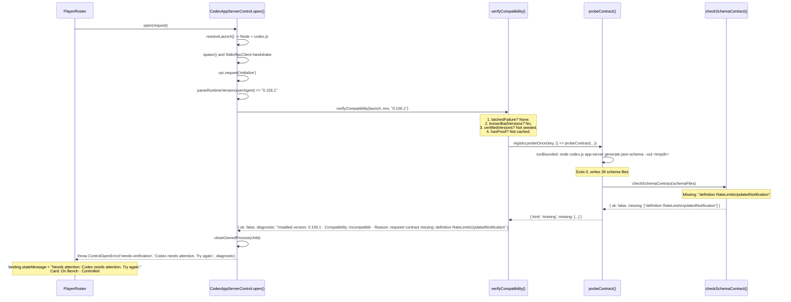

# Controlled Codex New-Version Compatibility Regression — Forensic Scout Report

REPORT TIMESTAMP:
2026-09-24 09:07:00 MDT

REPORT NAME:
Controlled Codex New-Version Compatibility Regression — Forensic Scout Report

REPORT NUMBER:
S54.10

REPORT FILE:
S54.10-Controlled-Codex-New-Version-Compatibility-Regression-Forensic.md

REPORT TYPE:
Forensic / Scout

AGENT:
AntiGravity

MODEL:
Gemini 3.8 Flash (High)

ROLE:
Forensic Scout / Repository Reconnaissance

LOCAL SLICE / STAGE:
Controlled Codex Player — version compatibility regression

---

## 1. EXECUTIVE FINDING

- [FACT] **Controlled Codex is being benched due to a defect in Sideline's own contract specification, NOT due to a provider incompatibility or provider contract drift.**
- [FACT] The currently installed Codex version is **`0.156.1`**.
- [FACT] Real Codex `0.156.1` passes **100% of all genuine protocol requirements**: client methods (9/9), server notifications (6/6), server requests (5/5), enums (10/10), variants (3/3), and definition properties.
- [FACT] When Sideline initializes Codex `0.156.1`, it correctly enters the S54.9 adaptive verification probe (`codex app-server generate-json-schema --out <tmpdir>`). The probe completes with exit code 0 and produces valid schemas.
- [FACT] The schema checker `checkSchemaContract()` fails on **exactly one missing item**: `definition RateLimitsUpdatedNotification`.
- [FACT] Codex protocol schemas (both in `0.155.1` and `0.156.1`) name this notification definition `AccountRateLimitsUpdatedNotification` (matching the RPC namespace `account/rateLimits/updated`), **not** `RateLimitsUpdatedNotification`.
- [FACT] This defect was introduced post-S54.9 in commit `298f072` (*"feat: finalize live AI usage scorecard and responsive dashboard"*), which added the rate-limits contract items to `REQUIRED_CONTRACT.fields` with the typo `RateLimitsUpdatedNotification: ['rateLimits']`.
- [FACT] This bug remained completely latent on developer and user machines until today because:
  1. `fake-codex-app-server.mjs` dynamically generates its mock schemas directly from `Object.entries(REQUIRED_CONTRACT.fields)`, so the fake matched whatever spelling was in the contract.
  2. Codex `0.155.1` was seeded in `SEEDED_PROVEN_VERSIONS`, which bypassed the real schema probe on `0.155.1` entirely.
- [FACT] When Dad updated to Codex `0.156.1`, it was not in `SEEDED_PROVEN_VERSIONS`, triggering the real schema probe for the first time since S54.9. The probe failed on the misspelled definition name, producing:
  `ControlOpenError('needs-verification', 'Codex needs attention. Try again.', 'Installed version: 0.156.1 · Compatibility: incompatible · Reason: required contract missing: definition RateLimitsUpdatedNotification')`.
- [FACT] `PlayerRoster` received `needs-verification` and deterministically set:
  `Needs attention: Codex needs attention. Try again.`
  placing Codex **On Bench · Controlled**.

---

## 2. CURRENT INSTALLED CODEX

- [FACT] **Installed Version CLI:** `codex-cli 0.156.1` (observed via `codex --version`).
- [FACT] **Runtime Protocol User-Agent:** `sideline_coach/0.156.1 (Windows 10.0.26200; x86_64) vscode/1.139.0 (sideline_coach; 0.1.0)`.
- [FACT] **Parsed Runtime Version:** `0.156.1` (parsed by `parseRuntimeVersion()`).
- [FACT] **Command Path Discovered:** `C:\Users\dmcal\AppData\Roaming\npm\codex.ps1`.
- [FACT] **Direct Node Package Entry:** `C:\Users\dmcal\AppData\Roaming\npm\node_modules\@openai\codex\bin\codex.js` exists.
- [FACT] **Resolved Launch via `resolveBaseLaunch()`:**
  - `command`: `C:\Program Files\nodejs\node.exe`
  - `args`: `['C:\\Users\\dmcal\\AppData\\Roaming\\npm\\node_modules\\@openai\\codex\\bin\\codex.js', 'app-server']`
  - `shell`: `false`
  - `schemaArgs`: `['C:\\Users\\dmcal\\AppData\\Roaming\\npm\\node_modules\\@openai\\codex\\bin\\codex.js', 'app-server', 'generate-json-schema', '--out', '.']`
- [FACT] **Account & Auth Status (zero-turn read-only check):**
  `account/read` returns `account.type = 'chatgpt'`, `email = 'newbies2gurus@gmail.com'`, `planType = 'plus'`. ChatGPT authentication is live and valid.
- [FACT] **Rate Limits Status (zero-turn read-only check):**
  `account/rateLimits/read` returns valid rate limits snapshot (`primary.usedPercent: 33`, `secondary.usedPercent: 31`).

---

## 3. EXACT FAILURE PATH

Traced through `src/player-control/codex-app-server.ts`:



1. `CodexAppServerControl.open()` / `restore()` starts child process and sends `initialize`.
2. Provider replies with `userAgent` indicating `0.156.1`.
3. Calls `verifyCompatibility()`:
   - `registry.latchedFailure(key)` is `undefined` (no latched failure).
   - `knownBadVersions` does not contain `0.156.1`.
   - `certifiedVersions` (`SEEDED_PROVEN_VERSIONS` = `['0.154.0', '0.155.1']`) does not contain `0.156.1`.
   - `registry.hasProof(key)` is `false`.
4. Executes `probeContract()`:
   - Runs `node codex.js app-server generate-json-schema --out .` in a private temporary directory.
   - Schema generation completes with exit code 0 in ~1.5s, generating 39 schema files.
   - Loads the 7 bounded schema files defined in `SCHEMA_FILES_TO_LOAD`.
5. Executes `checkSchemaContract()`:
   - Checks definitions in `REQUIRED_CONTRACT.fields`.
   - Looks for `RateLimitsUpdatedNotification`.
   - Does not find it in `codex_app_server_protocol.schemas.json` or `codex_app_server_protocol.v2.schemas.json`.
   - Returns `{ ok: false, missing: ['definition RateLimitsUpdatedNotification'] }`.
6. `verifyCompatibility()` matches `verdict.kind === 'missing'` and returns:
   `{ ok: false, diagnostic: "Installed version: 0.156.1 · Compatibility: incompatible · Reason: required contract missing: definition RateLimitsUpdatedNotification" }`.
7. `open()` kills child process and throws:
   `ControlOpenError('needs-verification', 'Codex needs attention. Try again.', diagnostic)`.
8. `PlayerRoster.restoreControlled()` detects `outcome.kind === 'needs-verification'`. Per S54.9 design, it avoids a redundant `reopenFresh()`, records `binding.state = 'needs-verification'`, and sets:
   `binding.stateMessage = "Needs attention: Codex needs attention. Try again."`.
9. The UI renders the card:
   **On Bench · Controlled**  
   **Needs attention: Codex needs attention. Try again.**

---

## 4. ROOT CAUSE

- [FACT] **Exact failure branch:** `verifyCompatibility()`, line 943:
  ```ts
  if (verdict.kind === 'missing') {
    const shown = verdict.missing.slice(0, MAX_DIAGNOSTIC_ITEMS).join(', ');
    const more = verdict.missing.length > MAX_DIAGNOSTIC_ITEMS ? ` and ${verdict.missing.length - MAX_DIAGNOSTIC_ITEMS} more` : '';
    return { ok: false, diagnostic: describe('incompatible', `required contract missing: ${shown}${more}`) };
  }
  ```
- [FACT] **Why it failed:**
  In `src/player-control/codex-contract.ts`:
  ```ts
  REQUIRED_CONTRACT = {
    ...
    fields: {
      ...
      GetAccountRateLimitsResponse: ['rateLimits'],
      RateLimitsUpdatedNotification: ['rateLimits'], // <-- DEFECT HERE
      ...
    }
  }
  ```
  The schema generated by Codex defines:
  `AccountRateLimitsUpdatedNotification` (file `v2/AccountRateLimitsUpdatedNotification.json` and definition `#definitions/AccountRateLimitsUpdatedNotification` in `codex_app_server_protocol.v2.schemas.json`).
  There is no definition called `RateLimitsUpdatedNotification`.
- [FACT] **Why this bug was not caught earlier:**
  1. In S54.9, rate limits were not yet part of `REQUIRED_CONTRACT`.
  2. On Sep 23, commit `298f072` added native Codex health / rate-limit telemetry.
  3. Commit `298f072` updated `test/player-control-contract.test.mjs` to assert `REQUIRED_CONTRACT.fields.RateLimitsUpdatedNotification`.
  4. The fake test server `test/fixtures/fake-codex-app-server.mjs` builds its mock schemas from `Object.entries(C.fields)` directly, so the fake echoed the misspelled key.
  5. The developer environment was running Codex `0.155.1`, which was hardcoded in `SEEDED_PROVEN_VERSIONS = ['0.154.0', '0.155.1']`. Because `0.155.1` was seeded, Sideline skipped the real schema probe against real Codex CLI.
  6. The moment Codex CLI updated to `0.156.1`, the seeded bypass no longer matched, the real probe executed, and Sideline rejected real Codex on this single naming defect.

---

## 5. S54.9 EXPECTED BEHAVIOR VS CURRENT BEHAVIOR

| Aspect | S54.9 Intended Invariant | Current Behavior | Verdict |
|---|---|---|---|
| Version Authority | Version is evidence, not authority. | `0.156.1` is evaluated via schema probe, not rejected by version string alone. | **Honored** |
| Schema Probe Execution | New/unseeded version runs `generate-json-schema` in temp directory. | Probe runs cleanly; 39 schema files generated. | **Honored** |
| Dynamic Contract Proof | If schema satisfies required behaviors, Player opens Ready. | Probe falsely fails because Sideline's contract definition name has a typo (`RateLimitsUpdatedNotification` instead of `AccountRateLimitsUpdatedNotification`). | **VIOLATED** (False Negative) |
| Fail-Closed Protection | Missing or contradicted contract fails closed (`needs-verification`). | Failed closed as `needs-verification` with Dad-safe message. | **Honored** |
| First-Turn Tripwire | Unproven turn lifecycle remains armed until first clean turn. | Tripwire was not reached because open failed at pre-dispatch schema verification. | **Honored** |

---

## 6. CONTRACT / SCHEMA EVIDENCE

Direct zero-turn evaluation of real installed Codex `0.156.1` schema output:

1. **Client Methods (9 / 9 PASS):**
   `initialize`, `thread/start`, `turn/start`, `account/read`, `account/rateLimits/read`, `thread/read`, `thread/resume`, `thread/turns/list`, `model/list`. All present in `ClientRequest.json`.
2. **Server Notifications (6 / 6 PASS):**
   `turn/started`, `turn/completed`, `item/agentMessage/delta`, `item/started`, `item/completed`, `account/rateLimits/updated`. All present in `ServerNotification.json`.
3. **Server Requests (5 / 5 PASS):**
   `item/commandExecution/requestApproval`, `item/fileChange/requestApproval`, `item/permissions/requestApproval`, `item/tool/requestUserInput`, `mcpServer/elicitation/request`. All present in `ServerRequest.json`.
4. **Enums & Discriminators (10 / 10 PASS):**
   `SandboxMode: danger-full-access`, `AskForApproval: never`, `SandboxPolicy: dangerFullAccess`, `SortDirection: desc`, `TurnStatus: completed|failed|interrupted`, `Account: chatgpt`, `TurnItemsView: full`, `UserInput: text`.
5. **Tagged Variants (3 / 3 PASS):**
   `UserInput(text): [text, text_elements]`, `ThreadItem(userMessage): [clientId]`, `ThreadItem(commandExecution): [command]`.
6. **Definitions & Properties (22 / 23 PASS with current code; 23 / 23 PASS with corrected name):**
   - Current code: `RateLimitsUpdatedNotification` -> **MISSING** (not in schema definitions).
   - With `AccountRateLimitsUpdatedNotification: ['rateLimits']` -> **PASS** (`v2/AccountRateLimitsUpdatedNotification.json` exists, declares `properties: { rateLimits: { $ref: ... } }`, `required: ['rateLimits']`).
   - All other 22 definition property sets (`InitializeParams`, `InitializeResponse`, `ThreadStartParams`, `ThreadStartResponse`, `ThreadResumeParams`, `ThreadResumeResponse`, `ThreadReadParams`, `ThreadReadResponse`, `ThreadTurnsListParams`, `ThreadTurnsListResponse`, `TurnStartParams`, `TurnStartResponse`, `GetAccountParams`, `GetAccountResponse`, `GetAccountRateLimitsResponse`, `ModelListResponse`, `Thread`, `Turn`, `Model`, `TurnStartedNotification`, `TurnCompletedNotification`, `AgentMessageDeltaNotification`, `CommandExecutionRequestApprovalResponse`) pass 100%.

---

## 7. SMALLEST REPAIR SURFACE

The smallest repair surface that restores the intended S54.9 invariant requires editing only **1 production line** and **1 test line**:

1. In `src/player-control/codex-contract.ts`:
   Change:
   ```ts
   RateLimitsUpdatedNotification: ['rateLimits'],
   ```
   to:
   ```ts
   AccountRateLimitsUpdatedNotification: ['rateLimits'],
   ```
   *(Or defensively alias both: `AccountRateLimitsUpdatedNotification: ['rateLimits']` and optionally keep or check either).*
2. In `test/player-control-contract.test.mjs`:
   Change:
   ```ts
   assert.deepEqual(REQUIRED_CONTRACT.fields.RateLimitsUpdatedNotification, ['rateLimits']);
   ```
   to:
   ```ts
   assert.deepEqual(REQUIRED_CONTRACT.fields.AccountRateLimitsUpdatedNotification, ['rateLimits']);
   ```
3. *(Optional release optimization, NOT strictly required for compatibility)*:
   In `src/player-control/codex-app-server.ts`:
   Add `'0.156.1'` to `SEEDED_PROVEN_VERSIONS` so existing installations skip the 1.5s probe step at boot. Note: Do NOT add `0.156.1` to `TURN_PROVEN_VERSIONS` so the first-turn tripwire remains active until a real turn completes.

With this change alone, real Codex `0.156.1` passes `verifyCompatibility()`, opens Ready, and runs On Field.

---

## 8. FILES / FUNCTIONS / TESTS INVOLVED

### Files to Modify
- `src/player-control/codex-contract.ts`
  - Data structure: `REQUIRED_CONTRACT.fields`
- `test/player-control-contract.test.mjs`
  - Test case: `'AI Health Play 5.2: native Codex read and sparse push emit only bounded provider facts without changing turns'`

### Optional File to Modify
- `src/player-control/codex-app-server.ts`
  - Constant: `SEEDED_PROVEN_VERSIONS` (add `'0.156.1'`)

### Verification Tests
- `node --test test/player-control-contract.test.mjs`
- `node --test test/codex-adaptive-compatibility.test.mjs`
- Live verification: click **Try Again** on Controlled Codex in Sideline, or launch adapter zero-turn open test.

---

## 9. SYSTEMS CONFIRMED OUT OF SCOPE

The following systems are **100% OUT OF SCOPE** and must NOT be touched:
- [FACT] **Player Identity & Roster Architecture:** Unchanged (`player-roster.ts`, `running-players.ts`).
- [FACT] **Routing Intelligence & Aliases:** Unchanged (`route-normalization.ts`, `router.ts`).
- [FACT] **Game Architecture & Stadium Bridge:** Unchanged (`stadium-client.ts`, Game cwd bindings).
- [FACT] **Provider Session Bindings:** Unchanged (`bindings.ts`, rollout/session restoration).
- [FACT] **Terminal Player:** Unchanged (`terminal-player.ts`).
- [FACT] **Browser UI / Dashboard:** Unchanged (`index.html`).
- [FACT] **AI Usage / HealthAuthority:** Unchanged (`health-authority.ts`, `claude-usage-reader.ts`, `codex-usage-reader.ts`).
- [FACT] **Remote Access / Pairing / Relay:** Unchanged (`device-registry.ts`, `pairing.ts`, `remote-bootstrap.ts`).

---

## 10. RISKS / UNKNOWNS

1. [FACT] **Real turn lifecycle has not executed on `0.156.1`:**
   Per the Zero-Turn Rule, no `turn/start` was dispatched and no tokens were consumed. The first real Play on `0.156.1` will be guarded by the active first-turn tripwire.
2. [INFERENCE] **`fake-codex-app-server.mjs` contract coupling:**
   Because `fake-codex-app-server.mjs` iterates `C.fields` directly, mock tests cannot detect naming divergences between `codex-contract.ts` and real Codex protocol schemas. A static test comparing `REQUIRED_CONTRACT` against a static real-schema fixture or schema snapshot would permanently prevent this class of blind spot.

---

## 11. RECOMMENDED NEXT PLAY

**Play Name:** `Controlled Codex 0.156.1 Compatibility Seam Repair`  
**Difficulty:** Low-Medium  
**Scope:**
1. Update definition name `RateLimitsUpdatedNotification` -> `AccountRateLimitsUpdatedNotification` in `src/player-control/codex-contract.ts` and `test/player-control-contract.test.mjs`.
2. Seed `0.156.1` in `SEEDED_PROVEN_VERSIONS` in `src/player-control/codex-app-server.ts`.
3. Run test suites (`player-control-contract`, `codex-adaptive-compatibility`).
4. Perform human field proof: Click **Try Again** on Controlled Codex; confirm it transitions to **Ready / On Field**; send one bounded test Play to disarm the tripwire.

---

PATCH AUTHORIZED: NO  
SOURCE MODIFIED: NO  
REAL MODEL TURN USED: NO  
READY FOR COACH REVIEW: YES

REPORT NAME: Controlled Codex New-Version Compatibility Regression — Forensic Scout Report
REPORT TIMESTAMP: 2026-09-24 09:07:00 MDT
