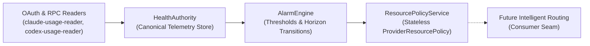

# SIDELINE COACH — RECONCILIATION REPORT S57.0
# INTELLIGENT ROUTING — A-TEAM SCOUT RECONCILIATION

**AGENT:** AntiGravity  
**MODEL:** Gemini 3.8 Flash  
**REASONING:** Medium  
**DIFFICULTY:** Architecture / Reconnaissance Review  
**ROLE:** A-Team Scout / Reconnaissance Reviewer  
**MODE:** READ-ONLY RECONNAISSANCE / RECONCILIATION  
**IMPLEMENTATION AUTHORITY:** NONE  
**ARCHITECTURE AUTHORITY:** NONE  
**GAME:** Sideline Coach  
**REPOSITORY:** `C:\Users\dmcal\Documents\GitHub\SidelineCoach`  
**BRANCH:** `q2.8-multigame-field-debug`  
**DATE:** September 25, 2026  
**TIMESTAMP:** 2026-09-25T18:47:20-06:00  
**PRIMARY INPUT FORMATION:** `routing-intelligence-prearchitecture-20260925-182712` (5/5 lanes completed)  

---

# INTELLIGENT ROUTING — A-TEAM FIELD PACKET

## 1. EXECUTIVE VERDICT

**`READY FOR OPUS 5.5 ARCHITECTURE`**

**Reason:**  
The reconnaissance terrain has been rigorously verified against source truth, five Scout contradictions have been resolved, and unsubstantiated cheap-Scout inferences have been downgraded. The canonical resource telemetry stack (Stage 2A: `HealthAuthority` → `AlarmEngine` → `ProviderResourcePolicy`) is already verified GREEN and requires no rediscovery or duplicate telemetry stores. Existing seams for context affinity (`context-affinity.ts`), busy-instance queuing (`play-queue.ts`), and receiver verification (`scout-combine.ts`) are intact. Opus 5.5 can proceed directly to algorithm, scorecard schema, and economic decision architecture without conducting additional reconnaissance.

---

## 2. VERIFIED CURRENT ROUTING MAP

Current routing is an orchestrated, layered dispatch pipeline spanning dispatch control, intent normalization, task classification, and candidate filtering.

### Source of Truth Files & Symbols

1. **Dispatch Orchestrator:**
   - **File:** `src/control-plane/router.ts` (`ControlPlaneRouter`)
   - **Symbols:**
     - `routePlay(options)`: Primary dispatch entry point. Evaluates human constraints, routing mode (`auto` vs `manual`), terminal classification, and busy-player queueing.
     - `manualSelection`: Human-chosen `{ playerInstanceId, model?, effort? }`; respected unconditionally without AUTO substitution.
     - `computeTerminalAutoRoute`: Specialized shell command classifier path (`classifyShellIntent`).
     - `whenBusy: 'queue'`: Intercepts target instance busy states and enqueues to `PlayQueue`.

2. **Routing Policy Engine:**
   - **File:** `src/routing-policy.ts`
   - **Symbols:**
     - `computeAutoRoute(...)`: Evaluates operable candidates against task classification and provider preferences.
     - `computeContextAwareRoute(...)`: Integrates context ownership from `context-affinity.ts` before falling back to default provider preferences.
     - `PROVIDER_PREFERENCE`: Static preference tables mapping `TaskClassification` (`architecture`, `implementation`, `quick`, `default`) to provider priority order (e.g. `architecture: ['claude', 'codex', 'antigravity']`).
     - `isScoutTarget(...)`, `computeScoutDirectiveRoute(...)`, `computeScoutAutoRoute(...)`: Separation of Scout control directives from general player routing.
     - `resolveCoachAuto(...)`: Resolves `model: 'auto'` or `effort: 'auto'` against catalog capability for an exact instance.

3. **Task & Intent Classifier:**
   - **File:** `src/play-analyzer.ts`
   - **Symbols:**
     - `classifyTask(prompt)`: Lexical classifier categorizing prompts into `'architecture'`, `'implementation'`, `'quick'`, or `'default'`.
     - `analyzeScoutNeed(prompt)`: Determines if a prompt requires reconnaissance prior to implementation.
     - `analyzeScoutContinuationAuthority(...)`: Validates post-Scout work authorization.

4. **Routing Envelope & Constraint Normalization (S56.0, S56.1, S56.2, S56.3):**
   - **File:** `src/control-plane/route-constraints.ts`
     - `recognizeRouteConstraints(...)`: Parses structured fields (`AGENT:`, `MODEL:`, `REASONING:`).
     - `structuredRouteField(...)`: Label resolution and dimension extraction.
   - **File:** `src/control-plane/route-normalization.ts`
     - `normalizeEnvelope(...)`: Normalizes model aliases against catalog truth without fuzzy guessing or typo auto-correction.
   - **File:** `src/control-plane/smart-route-resolver.ts`
     - `resolveSmartRoutePrompt(...)`: Parses first-line human shorthand (e.g. `"Claude Sonnet"`) and control-shaped titles before task classification.

5. **API & Staged Preview Seams:**
   - **File:** `src/control-plane/daemon.ts`
     - `POST /api/route`: Updates global `routingMode` (`'auto'` | `'manual'`) and `manualSelection`.
     - `POST /api/route/preview`: Invokes `router.buildRouting` on typed prompt input to supply live preview chips (`autoRouteDecisionChip`) and rationale to the UI.

---

## 3. VERIFIED RESOURCE / RESET MAP

The resource stack is mature and strictly separated from routing consumers. Stage 2A is GREEN.

### Ownership Chain


### Exact Component Map

| Component | Source Authority | Persistence | Current Consumer | Exposed Telemetry / Facts |
|---|---|---|---|---|
| **HealthAuthority** | `src/control-plane/health-authority.ts` | `~/.sideline/ai-health-state.json` (`fileHealthStateStore`) | `AlarmEngine`, Status API | Window utilization (0..1), `resetsAt` (Unix s), `observedAt`, provider source provenance. |
| **AlarmEngine** | `src/control-plane/alarm-engine.ts` | `~/.sideline/alarm-state.json` (`fileAlarmStateStore`) | Status API, notifications, `ResourcePolicyService` | Rule state (`NORMAL`, `LOW`, `CRITICAL`, `UNKNOWN`), `horizonResetsAt`, `lastProcessedResetCycle`, normalized facts (`remainingPercent`, `resetsAt`, `stale`). |
| **ResourcePolicyService** | `src/control-plane/resource-policy.ts` | Stateless (pure projection of `AlarmStateSnapshot`) | Instantiated in `daemon.ts` | `ProviderResourcePolicy`: `provider`, `isConserveActive`, `conserveLevel` (`none`/`low`/`critical`), `evidenceState` (`known`/`unknown`), `rationale`, `activeResetsAt`. |

### Current Routing Accessibility
- **Can Routing consume ResourcePolicy today?** No. `ResourcePolicyService` is instantiated on `daemon.ts`, but `src/control-plane/router.ts` and `src/routing-policy.ts` do not yet accept or query it.
- **Smallest Seam Required:** Pass `ResourcePolicyService` (or an interface `ResourcePolicyReader`) into `computeAutoRoute` and `computeContextAwareRoute`.

---

## 4. VERIFIED SCORECARD / OUTCOME MAP

### What Exists (Combine Receiver Scorecards)
- **Files:** `src/scout-combine.ts`, `src/scout-combine-formation-bridge.ts`, stored under `REPORTS/Scout Only/Combine/Scorecards/*.json` (27 durable scorecards).
- **Tracked Fields:** `candidateId`, `provider`, `model`, `displayName`, `harness`, `firstSeen`, `lastSeen`, `lastTryoutAt`, `currentStatus` (`READY`, `CALL BACK LATER`, `LIMITED`, `UNAVAILABLE`), `totals` (`starts`, `completions`, `failures`, `providerFailures`, `rateLimitFailures`, `authFailures`, `blocked`), `routeAttempts`, `availabilityEvidence`, `qualificationEvidence`, `evaluationEvidence`.
- **Purpose:** Tracks **infrastructure readiness and execution-contract compliance** for Scout receivers (did the process exit cleanly, did it follow read-only contracts, did it deliver required markdown sections).

### What Does NOT Exist (Primary Player Performance)
- **No General Player Performance Scorecards:** Zero durable records track Claude, Codex, or AntiGravity solution correctness, coding capability, or task fit.
- **No Player-Caused Fix Attribution:** Current failure logs record process exit codes and network errors. The system cannot distinguish whether a repair Play was caused by:
  - Player coding bug vs.
  - Human prompt/spec shift vs.
  - Environment/tool drift vs.
  - Faulty Scout reconnaissance evidence vs.
  - Upstream dependency change.
- **No Play-Level Cost Evidence:** Neither `InstanceWorkLedger` nor `router.ts` records quota snapshots before/after Plays. Exact per-Play quota attribution is technically infeasible due to usage polling latencies (3-15 min OAuth cadence), concurrent background tasks, and unmetered external provider activity.

---

## 5. VERIFIED FIELD-POSSESSION MAP

Field possession determines whether an active Player already holds working context.

| Evidence Level | Possession Indicator | Source of Truth | Reliability |
|---|---|---|---|
| **PROVEN** | Explicit report provenance header | `src/report-provenance.ts` (`ReportProvenance`) | **High / Conclusive** — Verified cryptographic/contract metadata. |
| **PROVEN** | Active running Play in Game | `src/control-plane/work-ledger.ts` (`currentPlay`) | **High / Conclusive** — Live in-memory ledger state. |
| **PROVEN** | Latest completed Play in Game | `src/control-plane/context-affinity.ts` (`latest-play`) | **High / Conclusive** — Exact timestamped sequence in ledger. |
| **PROVEN** | Report written within 2-min grace | `src/control-plane/work-ledger.ts` (`REPORT_GRACE_MS`) | **High** — Single-active-play correlation. |
| **LIKELY** | Prompt references recent report wording | `src/control-plane/context-affinity.ts` (`detectFollowUp`) | **Medium** — Heuristic keyword match (`medium` confidence). |
| **LIKELY** | File touches overlap recent Play | `src/control-plane/work-ledger.ts` (`touches`) | **Medium** — Stated intent, not verified file read. |
| **UNKNOWN** | Long-term session continuity | Bounded in-memory ledger (10 items) | **Unknown / Unrecorded** — Lost on Control Plane restart. |
| **UNKNOWN** | Human/Reviewer read-receipt | No UI telemetry on report viewing | **Unknown** — Existence of report does not prove consumption. |
| **UNKNOWN** | Context staleness decay | Fixed 2-minute grace window only | **Unknown** — No multi-hour or multi-day decay curve. |

---

## 6. VERIFIED SCOUT-PROVENANCE MAP

### Trustworthy Provenance
1. **Control Plane Harness Truth:** `completion.json` and master reports generated by `src/scout-receiver-identity.ts` and `src/scout-play-runner.ts`. Identity fields (`agent`, `provider`, `model`, `displayName`) are stamped directly from runtime process configuration.
2. **Standard Provenance Comment:** `<!-- sideline-provenance: {...} -->` embedded in report headers containing `gameId`, `clientRef`, `playerInstanceId`, `playerType`, `provider`, `model`, `at`.
3. **Execution Compliance:** Exit codes, attempt counts, execution duration (`durationMs`), and stdout/stderr paths.

### Untrustworthy / Unverified Provenance
1. **Child Scout Report Markdown Frontmatter:** Scout agents frequently hallucinate metadata in their own markdown output (e.g. declaring `SCOUT REASONING / EFFORT: Medium` when running on models that do not support reasoning effort parameters).
2. **Scout Inferences on System Capabilities:** Scout models running bounded reconnaissance routinely mistake their inability to observe runtime state for the absence of that subsystem in the host codebase.
3. **Unchecked Capability Claims:** Any capability claim not backed by a verified Combine tryout or explicit catalog entry.

---

## 7. VERIFIED SCHEDULING / NEXT-BEST MAP

### Existing: Busy-Player Concurrency Queueing
- **Component:** `src/control-plane/play-queue.ts` (`PlayQueue`)
- **Persistence:** Atomic JSON file store (`fileQueueStore`) surviving Control Plane restarts.
- **Semantics:** Pure concurrency buffering. If target player instance `X` is currently `working` on a Play in `gameId`, an incoming Play with `whenBusy: 'queue'` enters state `queued`. When the active Play completes, the queue head transitions to `dispatching`.
- **Constraint:** A queued Play is locked to its specific instance; it is never automatically reassigned to a sibling.

### Missing: Reset-Horizon Scheduling
- **Zero reset-aware scheduling exists today.** There is no mechanism to schedule a Play for execution after a 5H or Weekly reset boundary (`activeResetsAt`).

### Missing: Next Best Player Recommendation
- **Zero economic Next Best Player recommendations exist.** While `src/routing-policy.ts` will fall back through `PROVIDER_PREFERENCE` if a provider has zero operable players, it does NOT provide an economic trade-off surface (e.g., "Claude is CRITICAL; Codex Terra is recommended as Next Best to save quota").

---

## 8. GLOBAL VS GAME-SPECIFIC OWNERSHIP

An explicit architectural boundary must be maintained to prevent state leakage or duplicate stores:

```
┌────────────────────────────────────────────────────────────────────────┐
│ LEAGUE-WIDE / GLOBAL (Machine & Account Scope)                         │
│                                                                        │
│ • HealthAuthority: Ingests OAuth & RPC rate limits; persists to        │
│   ~/.sideline/ai-health-state.json                                     │
│ • AlarmEngine: Evaluates 5H & Weekly rules; persists transitions to    │
│   ~/.sideline/alarm-state.json                                         │
│ • ResourcePolicyService: Stateless scarcity projection (isConserve,    │
│   conserveLevel, driving reset)                                        │
│ • Combine Prospect Scorecards: Receiver readiness across all runs      │
│ • Global Coach Preferences: Alarm thresholds, Dev Mode toggle          │
└───────────────────────────────────┬────────────────────────────────────┘
                                    │ Pure Query Seam
                                    ▼
┌────────────────────────────────────────────────────────────────────────┐
│ GAME-SPECIFIC CONTEXT (Workspace & Repository Scope)                   │
│                                                                        │
│ • InstanceWorkLedger: In-memory active & recent plays for Game         │
│ • PlayQueue: Queued plays per Game and target Player instance          │
│ • Context Affinity: Follow-up detection & report ownership for Game    │
│ • Active Strategy Board: Human prompt, manual selection, staged route  │
│ • Game Filesystem & Git: Working tree, branch, diffs, local reports    │
└────────────────────────────────────────────────────────────────────────┘
```

---

## 9. CONTRADICTIONS RESOLVED

### Contradiction A — CONSERVE
- **Scout Claim A (Lane 1):** CONSERVE exists only as a future breadcrumb; no implementation found.
- **Scout Claim B (Lane 5):** Some CONSERVE-aware routing exists in Scout Combine operations.
- **Source Truth:**
  - Stage 2A implemented the canonical stateless `ResourcePolicyService` in `src/control-plane/resource-policy.ts`. It exports `ProviderConserveLevel` (`'none' | 'low' | 'critical'`) and computes `isConserveActive` based on `AlarmEngine`'s canonical rule state (`LOW` or `CRITICAL`).
  - `scout-combine-formation-bridge.ts` contains docstrings mentioning CONSERVE as a future consumer (`WILL BE: ... future AUTO/CONSERVE decisions`), but Combine itself has no active CONSERVE routing logic.
  - `router.ts` does not yet query `ResourcePolicyService`.
- **Reconciliation:** CONSERVE is implemented as a canonical policy projection service (`ResourcePolicyService`), but is not yet wired as an input to the routing dispatch pipeline. Lane 1 missed `resource-policy.ts`; Lane 5 conflated design docstrings and free-tier tryouts with active routing logic.

### Contradiction B — A-Team / B-Team / Scout
- **Scout Claim A (Lane 1):** A-Team / B-Team / Scout distinctions are not implemented.
- **Scout Claim B (Lane 4):** Team-aware routing exists: A-Team / B-Team / Scout routing in `routing-policy.ts`.
- **Source Truth:**
  - `src/routing-policy.ts` implements dedicated routing paths for the Scout virtual player (`isScoutTarget`, `computeScoutDirectiveRoute`, `computeScoutAutoRoute`).
  - In `routing-policy.ts`, "Team" refers strictly to the Stadium's active player roster (`context.rosterInstanceIds`).
  - There is zero code or routing distinction between "A-Team" and "B-Team".
- **Reconciliation:** "A-Team" is an operational and architectural term for primary frontier agents (Claude, Codex, AntiGravity); "Scout" is a first-class routing target. "B-Team" does not exist in code. Lane 4 hallucinated formal team tiering based on comment breadcrumbs; Lane 1 correctly noted the absence of formal A/B team tiers.

### Contradiction C — AI Health / 5H / Weekly Telemetry
- **Scout Claim A (Lane 2):** 5H/Weekly state management is absent; no resource window tracking or reset horizon data.
- **Scout Claim B (Lane 4):** Identified `HealthAuthority`, `AlarmEngine`, and `ProviderResourcePolicy`, but claimed 5H/Weekly percentages are trapped and unavailable.
- **Source Truth:**
  - `src/control-plane/health-authority.ts` persists exact window utilizations and reset timestamps.
  - `src/control-plane/alarm-engine.ts` (`normalizeAlarmFacts`) normalizes `remainingPercent`, `resetsAt`, and `stale` for both 5H and Weekly windows for Claude and Codex.
  - `src/control-plane/resource-policy.ts` projects `activeResetsAt` and `conserveLevel`.
- **Reconciliation:** 5H and Weekly telemetry, persistence, horizon calculation, and scarcity policies are fully implemented and verified GREEN. Lane 2 failed to discover the control-plane health stack. Lane 4 correctly identified the components but overlooked that `AlarmEngine` already exposes normalized remaining percentages.

### Contradiction D — Context Possession
- **Scout Claim A (Lane 1):** Found `context-affinity.ts` with report ownership and latest Play continuity.
- **Scout Claim B (Lane 3):** Concluded context possession tracking is largely missing and recommended immediate implementation of runtime tracking.
- **Source Truth:**
  - `src/control-plane/context-affinity.ts` (`resolveContextOwner`) actively tracks report ownership via explicit provenance and single-active-play ledger records, assigning `ownerInstanceId` with `strong` or `medium` confidence.
  - `src/control-plane/work-ledger.ts` maintains active and recent play state per player instance.
- **Reconciliation:** Context ownership and play continuity are already well-implemented for reports and active turns. Lane 3 mistakenly equated the absence of static marker files during an idle inspection with a complete absence of runtime tracking. Lane 3's recommendation to build runtime tracking from scratch is rejected.

### Contradiction E — Scout Model & Reasoning Metadata
- **Scout Claim A (Formation Master):** Master table records reasoning effort as `UNKNOWN - not exposed by provider (provider-managed)`.
- **Scout Claim B (Child Report 2):** Child report headers declare `SCOUT REASONING / EFFORT: Medium`.
- **Source Truth:**
  - `src/scout-receiver-identity.ts` defines `REASONING_EFFORT_UNKNOWN` and explicitly enforces: "Reasoning effort is read from the agent definition only when that definition actually declares one; otherwise it is stated as UNKNOWN — never guessed."
  - The model assigned was `openrouter/cohere/north-mini-code:free`, which has no configurable reasoning parameter.
- **Reconciliation:** The master report and harness (`completion.json`) are authoritative. Child report claims of "Medium" reasoning effort are unverified model output artifacts and must not be trusted as routing evidence.

---

## 10. MINIMUM MISSING EVIDENCE

Opus 5.5 needs to design the following targeted evidence additions:

1. **Normalized Remaining Percentages on `ProviderResourcePolicy`:**
   - Currently, `ProviderResourcePolicy` projects `conserveLevel` and `activeResetsAt`. It should also expose `fiveHourRemainingPercent` and `weeklyRemainingPercent` (already computed in `AlarmEngine.normalizeAlarmFacts`).
2. **Player Performance Scorecard Schema:**
   - Durable data schema for primary Players tracking:
     - Task classification fit (`architecture`, `implementation`, `quick`, `recon`).
     - First-pass success rate (accepted by Coach without follow-up repair).
     - Fix attribution breakdown.
3. **Fix Attribution Classification:**
   - A structured categorization schema for follow-up Plays:
     - `player-defect` (minor syntax/logic error vs. major structural failure).
     - `prompt-change` (human altered requirements or constraints).
     - `environment-drift` (tool, dependency, or runtime infrastructure failure).
     - `bad-scout-evidence` (scout provided erroneous factual claims).
     - `upstream-change` (architectural refactor invalidated prior work).
4. **Schedule-After-Reset Intent & Seam:**
   - Extension to `PlayQueue` or a dedicated scheduling trigger that holds a Play until `AlarmEngine` signals `alarm:reset_boundary_reached` or `alarm:recovered`.
5. **Context Staleness / Decay Curve:**
   - A defined time-decay function to degrade context affinity confidence from `strong` → `medium` → `low` → `none` over hours/days.

---

## 11. EXISTING ASSETS OPUS MUST REUSE

To avoid redundant engineering, Opus 5.5 must build upon these verified components:

1. **`ResourcePolicyService` (`src/control-plane/resource-policy.ts`):** The sole gateway for provider scarcity and CONSERVE state.
2. **`AlarmEngine` (`src/control-plane/alarm-engine.ts`):** Canonical evaluator of thresholds, stale status, and reset horizons.
3. **`HealthAuthority` (`src/control-plane/health-authority.ts`):** Canonical store for raw provider usage and rate-limit evidence.
4. **`context-affinity.ts` (`src/control-plane/context-affinity.ts`):** Proven context ownership detection via `resolveContextOwner` and `detectFollowUp`.
5. **`InstanceWorkLedger` (`src/control-plane/work-ledger.ts`):** In-memory tracking of active and recent player turns and file touches.
6. **`PlayQueue` (`src/control-plane/play-queue.ts`):** Durable, file-backed FIFO queuing for busy player instances.
7. **Routing Envelope Normalization (`src/control-plane/route-constraints.ts`, `route-normalization.ts`, `smart-route-resolver.ts`):** Complete handling of structured headers, aliases, and human shorthand.
8. **Combine Scorecard Schema (`src/scout-combine.ts`):** Reference patterns for durable scorecard persistence and totals tracking.
9. **UI Gating (`status.preferences.devMode` in `src/public/index.html`):** The clean separation between Dad Mode and Dev Mode.

---

## 12. QUESTIONS OPUS MUST DECIDE

The following architectural decisions belong strictly to Opus 5.5:

1. **Statistical Unit of Routing:**
   - Should routing intelligence score `Player + Model + Reasoning` as a single composite unit, or evaluate hierarchically (`Provider` → `Player` → `Model` → `Effort`)?
2. **Cold-Start Weighting Formula:**
   - What mathematical formula balances researched capability priors with scarce local Sideline reps (e.g. empirical Bayesian smoothing vs. simple weighted averaging)?
3. **Fix Attribution Mechanism:**
   - How should repair attribution be assigned in V1? (Explicit Coach prompt tag, interactive prompt on follow-up, or automated diff/test heuristics?)
4. **Reset-Horizon Scheduling Architecture:**
   - Should delayed execution be handled by extending `PlayQueue` with a `scheduledAt` timestamp, or by a dedicated timer/event listener subscribing to `AlarmEngine` reset events?
5. **Dad Mode Presentation Density:**
   - How should the single-line recommendation chip communicate economic trade-offs (e.g., `"Codex · 92% fit · Saves 18% Claude 5H window"` vs `"Claude Sonnet · Best fit · Resets in 45m"`)?
6. **CONSERVE Routing Behavior:**
   - When `conserveLevel` is `'low'` or `'critical'`, does AUTO:
     - Downgrade model tier within the same provider (Opus → Sonnet)?
     - Re-rank to the Next Best operable provider (Claude → Codex)?
     - Prompt Coach to Schedule-After-Reset?

---

## 13. THINGS OPUS MUST NOT REDISCOVER

1. **Do not rediscover AI Health or Quota persistence.** `HealthAuthority` and `AlarmEngine` are fully functional, tested, and persist to `~/.sideline/`.
2. **Do not scrape the UI Scoreboard.** The Scoreboard in `src/public/index.html` is a downstream consumer of Control Plane status, not an authority.
3. **Do not conflate Combine Scorecards with Player Competence.** Combine scorecards track receiver process viability, not coding intelligence.
4. **Do not recreate context ownership logic.** `context-affinity.ts` already handles report attribution and latest Play tracking.
5. **Do not re-parse routing constraints.** Envelope parsing (`AGENT:`, `MODEL:`, `REASONING:`) is already solved in S56.0–S56.3.

---

## 14. THINGS OPUS MUST NOT IMPLEMENT YET

1. **Do not attempt real-time per-play token cost metering.** Usage telemetry latency and concurrent out-of-band usage make exact per-play quota math impossible.
2. **Do not implement automated unattended Player substitution.** Coach must remain the final authority in V1.
3. **Do not implement complex multi-armed bandit or reinforcement learning models.** Keep statistical ranking simple, transparent, and debuggable.
4. **Do not alter or refactor Stage 2A source code.** Treat `ResourcePolicyService` as a stable upstream contract.

---

## 15. RECOMMENDED ARCHITECT CONTEXT PACKAGE

Opus 5.5 requires only the following minimal reading list:

1. **Reconciliation Report (This Document):**
   - `REPORTS/AntiGravity/S57.0-Intelligent-Routing-A-Team-Scout-Reconciliation.md`
2. **Stage 2A Architecture Record:**
   - `REPORTS/Codex/S56.5-AI-Resource-Policy-Stage-2A-Canonical-Scarcity-Interpretation.md`
3. **Core Seam Implementations:**
   - `src/control-plane/resource-policy.ts` (130 lines — exact scarcity projection interface)
   - `src/control-plane/alarm-engine.ts` (Lines 1–100, 248–340 — normalized alarm facts and rule states)
   - `src/control-plane/context-affinity.ts` (Lines 1–150 — context ownership and follow-up contract)
   - `src/control-plane/work-ledger.ts` (Lines 1–100 — instance ledger contracts)
   - `src/control-plane/play-queue.ts` (Lines 1–70 — queue state contracts)
   - `src/routing-policy.ts` (Lines 210–240, 520–575, 685–750 — preference tables and auto routing)

---

## 16. FINAL VERDICT

**`READY FOR OPUS 5.5 ARCHITECTURE`**

The reconnaissance landscape is clear, the telemetry foundation is solid, and the boundary between league-wide resource truth and game-specific context is firmly established. Opus 5.5 has all required inputs to design the Intelligent Routing & Routing Economics engine.

---

REPORT NAME: Intelligent Routing — A-Team Scout Reconciliation  
REPORT TIMESTAMP: 2026-09-25T18:47:20-06:00
