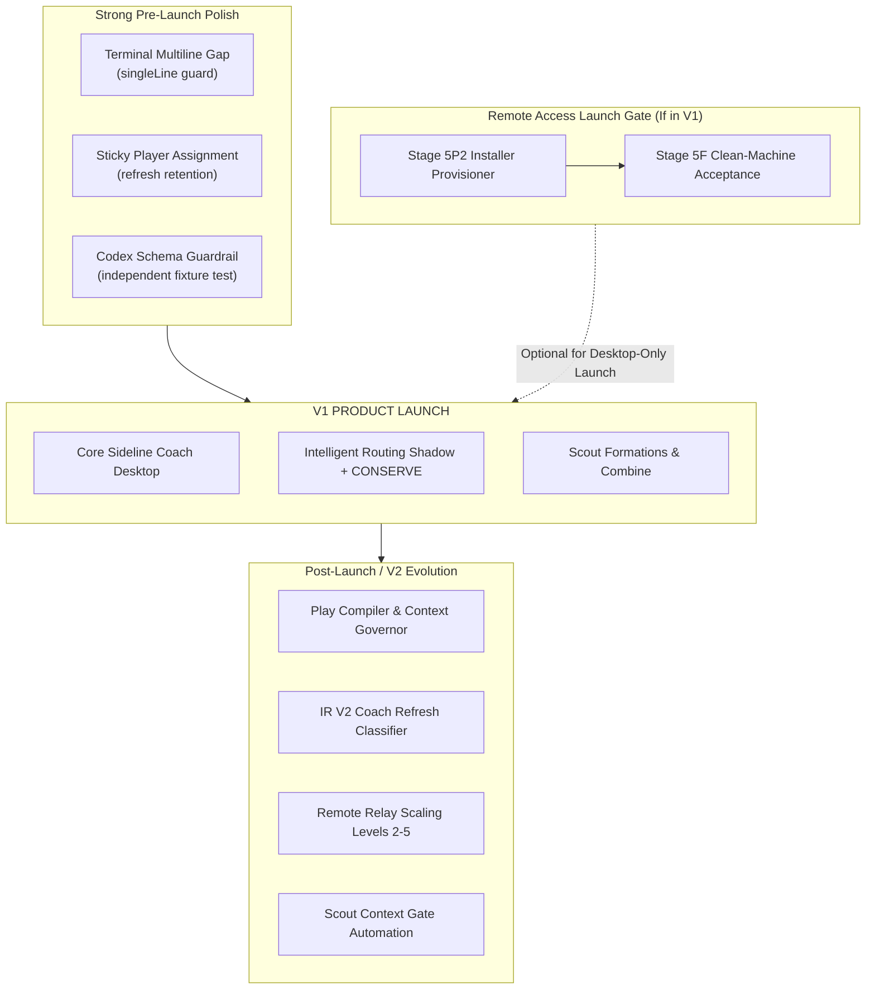

# S57.31 — Master Breadcrumb Field Map Reconciliation

**REPORT NAME:** Master Breadcrumb Field Map Reconciliation  
**REPORT TIMESTAMP:** 2026-09-27 12:51:30 MDT  
**AGENT:** AntiGravity  
**ROLE:** Pre-Implementation Scout / Product Reconciler  
**MODE:** READ-ONLY RECONCILIATION / PRODUCT INTELLIGENCE (Implementation Forbidden)  
**STATUS:** COMPLETE — FIELD READY FOR COACH  

---

## 1. Executive Field Map

### 1.1 The Real State of Sideline Coach
Sideline Coach is in a substantially more advanced, launch-ready state than early documentation or stale Scout reconnaissance suggested:
1. **Intelligent Routing Stack (R0–R10): COMPLETE.** The entire R-series pipeline—from R0 researched prior packs through R1 economics, R2 film, R3 belief, R4 candidate extraction, R5 attribution, R6 recommendation engine, R7 dev panels, R8 dad advisory (dormant behind closed gate), R9 DeferredPlay scheduling, and R10 calibration graduation—is implemented, verified, and running in production code.
2. **CONSERVE Actuator: IMPLEMENTED.** The hardware-style actuator on the Dispatcher bar (`#conserveToggleBtn` + lamp + `CONSERVE ⓘ`) is active in `src/public/index.html` and `src/control-plane/daemon.ts`, modifying utility weights ($\lambda_C = 2.5, \lambda_D = 0.01$) without touching alarm scarcity truth.
3. **AI Health, Alarms, and Scoreboard: COMPLETE.** Global HealthAuthority, persistent Scorecard with multi-mode settings, AlarmEngine threshold tracking, and ResourcePolicyService are fully operational.
4. **Scout Formation & Combine: COMPLETE.** Multi-lane Scout execution with automatic failover and substitution, Combine tryouts, and Scout ROI economics are implemented and running.
5. **Remote Access (Stages 1–5): COMPLETE.** Security foundation, token bootstrap, principal isolation, pairing protocol, relay wire, production relay (Fly.io with wildcard TLS), mobile client UI, and mobile reconnection are verified.
6. **Commercial Foundation (C0–C9): COMPLETE.** Capability/meter/profile framework is active in `src/commercial/` with unlimited founder envelope.

### 1.2 The Breadcrumb Corpus Audit
A comprehensive audit of `Project SOP\Breadcrumbs\` reveals **exactly 25 files** (not 23 or 24 as reported by the Scout formation):
- **11 Breadcrumbs are FULLY IMPLEMENTED (DONE).**
- **2 Breadcrumbs are SUPERSEDED / INVESTIGATION OBSOLETE.**
- **2 Breadcrumbs are LAUNCH BLOCKERS** (strictly if Remote Access is a V1 feature; both relate to zero-setup packaging).
- **3 Breadcrumbs are STRONG PRE-LAUNCH CANDIDATES** (high-trust bug fixes & hardening: multiline terminal output, sticky player assignment, Codex schema guardrail).
- **7 Breadcrumbs belong to POST-LAUNCH / V2** (Play Compiler, Context Governor, Coach Refresh Semantic Classifier, Relay scaling ladders, Scout context gating).

---

## 2. Corrected Complete Breadcrumb Inventory

The Scout formation reported 23 files in its summary and 24 in its catalog, completely omitting `INTELLIGENT ROUTING V2 - COACH REFRESH SEMANTIC CLASSIFICATION.md`. 

The authoritative repository inventory contains **25 files**:

| # | File Name | Title in Document | Stated Problem | Original WHY |
|---|---|---|---|---|
| 1 | `AI-Health-Factual-Parity.md` | AI Health factual parity — future investigation | Sideline AI Usage may lag external realtime reader (Claude ~10pp drift). | Telemetry freshness must reflect provider truth without guessing. |
| 2 | `BREADCRUMB - AI-USAGE-ALARM-THRESHOLD-ROUTING-CONSERVE.md` | BREADCRUMB: AI-USAGE-ALARM-THRESHOLD-ROUTING-CONSERVE | Usage telemetry was passive; needed proactive alarms, threshold transitions, and routing conservation. | Establish alarm nervous system and connect thresholds to routing scarcity. |
| 3 | `BREADCRUMB -- SIDELINE-PLAY-COMPILER-AND-INTELLIGENT-ROUTING.md` | BREADCRUMB: SIDELINE-PLAY-COMPILER-AND-INTELLIGENT-ROUTING | Human/Coach sends massive duplicate context in follow-ups (675+ lines redundant context). | "KNOWN CONTEXT MUST NOT BE REPURCHASED." Routing must compile minimum execution packets. |
| 4 | `BREADCRUMB - AUTO MODE NATURAL-LANGUAGE PLAYER.md` | BREADCRUMB — AUTO MODE NATURAL-LANGUAGE PLAYER / MODEL / REASONING RECOGNITION | Typing "Sonnett Medium" or "Gemini Flash" in prompt doesn't auto-configure dispatch. | "Dad types what he means. Sideline Coach figures out WHO, WHICH model, and HOW HARD." |
| 5 | `BREADCRUMB - REMOTE ACCESS V1 · DEV HOST PROVISIONING VS PRODUCT-COMPLETE PROVISIONING.md` | BREADCRUMB — REMOTE ACCESS V1 · DEV HOST PROVISIONING VS PRODUCT-COMPLETE PROVISIONING | Dev host functional testing bypassed formal installer via manual file copy. | "TESTING SHORTCUT ≠ PRODUCT INSTALLATION PATH." Real-World Green ≠ Product-Complete Green. |
| 6 | `BREADCRUMB - REMOTE ACCESS V1 · FRESH-INSTALL ZERO-SETUP PROVISIONING ACCEPTANCE.md` | BREADCRUMB — REMOTE ACCESS V1 · FRESH-INSTALL ZERO-SETUP PROVISIONING ACCEPTANCE | Enrollment credentials must never be baked into VSIX or entered manually by Dad. | "ZERO SETUP MUST BE ACHIEVED THROUGH SAFE PROVISIONING, NOT SECRET EMBEDDING." |
| 7 | `BREADCRUMB - REMOTE RELAY SCALING PLAN.md` | BREADCRUMB — REMOTE RELAY SCALING PLAN | Naive horizontal scaling breaks host-to-phone pairing if instances don't share state. | Scale ladder Levels 0–5: Single instance is enough until metrics prove multi-node need. |
| 8 | `BREADCRUMB - SCOUT CONTEXT GATE - FIELD PACKET.md` | BREADCRUMB — SCOUT CONTEXT GATE / FIELD PACKET | Expensive premium players repurchase repository reconnaissance already gathered by Scouts. | "Scout duplication is acceptable. Premium duplication is the enemy." Preflight Field Packets. |
| 9 | `BREADCRUMB - SCOUT PLAYER LIVE FORMATION STATUS IN VISUAL TERMINAL.md` | BREADCRUMB — SCOUT PLAYER LIVE FORMATION STATUS IN VISUAL TERMINAL | Scout visual terminal showed raw stdout instead of clean lane progress. | "Watch the sideline, not the Scout's notebook." Structured event rendering without text scraping. |
| 10 | `BREADCRUMB- AI-USAGE-SCORECARD.md` | BREADCRUMB: AI-USAGE-SCORECARD-PERSISTENT-SIDELINE-SURFACE | Telemetry was not matriculated into a persistent, accessible bottom UI card. | AI Health is shared routing infrastructure; UI must be persistent and provider-neutral. |
| 11 | `BREADCRUMB- CANONICAL-PLAY-ROUTING-ENVELOPE.md` | BREADCRUMB: CANONICAL-PLAY-ROUTING-ENVELOPE | AUTO routing could collapse unresolved explicit parameters into heuristic guesses. | Deterministic routing envelopes (`ROLE:`, `PLAYER:`, `MODEL:`, `EFFORT:`). |
| 12 | `c10-complete later-LAUNCH.md` | c10-complete later-LAUNCH | Pointer to commercial backend trust architecture (`S57.6`). | Post-launch commercial activation marker. |
| 13 | `Codex Compatibility Independent Schema Guardrail.md` | Codex Compatibility Independent Schema Guardrail | Typo in Sideline contract mirrored in fake test schema benched real Codex 0.156.1. | Build pipeline must test against independent real-world schema fixtures. |
| 14 | `Dynamic Team & Resource Scorecard - Release Breadcrumb.MD` | Dynamic Team & Resource Scorecard — Release Breadcrumb | Fixed assumption of Claude+Codex breaks when users have only one or alternative providers. | Scoreboard must dynamically render whichever resource pools are actually discovered. |
| 15 | `INTELLIGENT ROUTING V2 - COACH REFRESH SEMANTIC CLASSIFICATION.md` | INTELLIGENT ROUTING V2 — COACH REFRESH SEMANTIC CLASSIFICATION | Custom NLP in Sideline is complex and high-maintenance; Assistant Coach can classify plays. | "Assistant Coach interprets the work. Sideline applies deterministic policy, plumbing, and evidence." |
| 16 | `PRODUCT COMMERCIALIZATION BREADCRUMBS.md` | SIDELINE COACH — PRODUCT COMMERCIALIZATION BREADCRUMBS | Avoid fragmented billing/licensing across platforms before initial product launch. | "BUILD CAPABILITIES ONCE. PACKAGE THEM LATER." Founder unlimited envelope. |
| 17 | `R-Series-Breadcrumbs` | Scout Routing Semantics — Future R-Series Constraint | Scout target was treated as a single receiver rather than a logical formation. | Formation-level reliability ($P_{\text{runs}}$) vs receiver-level film; tryouts vs game film. |
| 18 | `R2 - SCOPED RESOURCE RECEIPTS and CONCURRENCY BREADCRUMB.md` | R2 — SCOPED RESOURCE RECEIPTS & CONCURRENCY BREADCRUMB | Overlapping plays credited entire provider burn to single play without isolation grading. | Record receipts only for consumed pool; record concurrency to know trustworthiness. |
| 19 | `Remote-Access-Architecture.md` | Remote Access architecture — durable breadcrumb | Dev bridge used insecure global admin token with no boundary between local and remote. | Principal-aware default-deny security architecture for local and remote access. |
| 20 | `Roster-Workflow-UI-Formations.md` | Roster / workflow UI — formation representation | B-Team worker formation and Scout formation lacked explicit visual cards on Roster UI. | Visual representation gap for concepts that already exist in routing/eligibility. |
| 21 | `Scout Intent Auto-Routing.md` | Breadcrumb — Scout Intent Auto-Routing | Natural language like "MODE: READ-ONLY RECONNAISSANCE" misparsed as model names. | Recognize Scout intent directives before parsing model constraints. |
| 22 | `Settings UI Plumbing Pass - Release Breadcrumb.MD` | Settings UI Plumbing Pass — Release Breadcrumb | Settings grew into long, cluttered vertical cards exposing internal plumbing to Dad. | Collapsed, expandable, draggable disclosure cards remembering state in IndexedDB. |
| 23 | `Settings-Information-Architecture.md` | Settings Information Architecture | Documentation of implemented card grammar and Dev Mode presentation bounds. | Keep plumbing available without making Dad stare at pipes; mobile coexistence. |
| 24 | `STICKY PLAY PLAYER ASSIGNMENT.md` | BREADCRUMB — STICKY PLAY PLAYER ASSIGNMENT | Selected Player reset/recalculated on capability refresh or temporary disconnect. | "Selection is an event. Refresh is not an event." Assignment persists until explicit change. |
| 25 | `Terminal Player Multiline Live-Output Gap.md` | Breadcrumb — Terminal Player Multiline Live-Output Gap | Pasting multiline text into Terminal Player bypassed Shell Integration, breaking live output. | Preserve observable execution path for multiline commands without privacy leaks. |

---

## 3. Verified Status & Horizon Table

| # | Breadcrumb File | Verified Status | Exact Supporting Evidence | Launch Horizon |
|---|---|---|---|---|
| 1 | `AI-Health-Factual-Parity.md` | **SUPERSEDED** | S57.10, `claude-usage-reader.ts`, `health-authority.ts` dual-window sync | **RETIRE / SUPERSEDED** |
| 2 | `BREADCRUMB - AI-USAGE-ALARM-THRESHOLD-ROUTING-CONSERVE.md` | **DONE** | `alarm-engine.ts`, `resource-policy.ts`, `routing-economics.ts`, S57.30 | **RETIRE / SUPERSEDED** |
| 3 | `BREADCRUMB -- SIDELINE-PLAY-COMPILER-AND-INTELLIGENT-ROUTING.md` | **PARTIALLY DONE** | IR R0-R10 done; Delta compiler & Context Governor unbuilt | **POST-LAUNCH / V2** |
| 4 | `BREADCRUMB - AUTO MODE NATURAL-LANGUAGE PLAYER.md` | **PARTIALLY DONE** | S56.0-S56.3 envelope/shorthand done; freeform fuzzy NLP unbuilt | **POST-LAUNCH / V2** |
| 5 | `BREADCRUMB - REMOTE ACCESS V1 · DEV HOST PROVISIONING...` | **PARTIALLY DONE** | Path A (dev) green; Path B (installer/provisioner) unbuilt | **LAUNCH BLOCKER** (if Remote in V1) |
| 6 | `BREADCRUMB - REMOTE ACCESS V1 · FRESH-INSTALL ZERO-SETUP...` | **PARTIALLY DONE** | Stage 5F gate specified; provisioner packaging pending | **LAUNCH BLOCKER** (if Remote in V1) |
| 7 | `BREADCRUMB - REMOTE RELAY SCALING PLAN.md` | **DONE (V1)** | Level 1 (Fly.io + TLS) verified in production; Levels 2-5 are future | **POST-LAUNCH / V2** |
| 8 | `BREADCRUMB - SCOUT CONTEXT GATE - FIELD PACKET.md` | **PARTIALLY DONE** | Manual field packets proven; automated gate unbuilt | **POST-LAUNCH / V2** |
| 9 | `BREADCRUMB - SCOUT PLAYER LIVE FORMATION STATUS...` | **NOT STARTED** | Scout execution works; live visual lane widget not built | **OPTIONAL PRE-LAUNCH** |
| 10 | `BREADCRUMB- AI-USAGE-SCORECARD.md` | **DONE** | Persistent scoreboard in `index.html`, fully configurable | **RETIRE / SUPERSEDED** |
| 11 | `BREADCRUMB- CANONICAL-PLAY-ROUTING-ENVELOPE.md` | **DONE** | S56.0, S56.1, S56.2 implemented in `route-constraints.ts` | **RETIRE / SUPERSEDED** |
| 12 | `c10-complete later-LAUNCH.md` | **DONE (ARCH)** | S57.6 defines C10 backend activation architecture | **POST-LAUNCH / V2** |
| 13 | `Codex Compatibility Independent Schema Guardrail.md` | **PARTIALLY DONE** | S54.9/S54.11 adaptive probe done; pipeline test fixture open | **STRONG PRE-LAUNCH** |
| 14 | `Dynamic Team & Resource Scorecard - Release Breadcrumb.MD` | **DONE** | Dynamic discovery of Claude, Codex, etc., verified in `index.html` | **RETIRE / SUPERSEDED** |
| 15 | `INTELLIGENT ROUTING V2 - COACH REFRESH SEMANTIC...` | **NOT STARTED** | S57.30 launched baseline; IR V2 architecture ready for later | **POST-LAUNCH / V2** |
| 16 | `PRODUCT COMMERCIALIZATION BREADCRUMBS.md` | **DONE (V1)** | C0-C9 implemented; `FounderUnlimited` envelope active | **RETIRE / SUPERSEDED** |
| 17 | `R-Series-Breadcrumbs` | **DONE** | S57.1 §10, `scout-roi.ts`, `recommend.ts`, `routing-film.ts` | **RETIRE / SUPERSEDED** |
| 18 | `R2 - SCOPED RESOURCE RECEIPTS and CONCURRENCY...` | **DONE** | S57.11, `routing-film.ts` receipts & concurrency isolation | **RETIRE / SUPERSEDED** |
| 19 | `Remote-Access-Architecture.md` | **DONE** | Stages 1-5 implemented, Ed25519 pairing, relay client live | **RETIRE / SUPERSEDED** |
| 20 | `Roster-Workflow-UI-Formations.md` | **NOT STARTED** | Roster UI shows players; explicit formation cards unbuilt | **POST-LAUNCH / V2** |
| 21 | `Scout Intent Auto-Routing.md` | **DONE** | S56.1 implemented in `src/control-plane/route-constraints.ts` | **RETIRE / SUPERSEDED** |
| 22 | `Settings UI Plumbing Pass - Release Breadcrumb.MD` | **DONE** | Implemented via disclosure cards and IndexedDB persistence | **RETIRE / SUPERSEDED** |
| 23 | `Settings-Information-Architecture.md` | **DONE** | Implemented state in production UI | **RETIRE / SUPERSEDED** |
| 24 | `STICKY PLAY PLAYER ASSIGNMENT.md` | **PARTIALLY DONE** | `manualSelection` tracked, edge-case resets on disconnect | **STRONG PRE-LAUNCH** |
| 25 | `Terminal Player Multiline Live-Output Gap.md` | **NOT STARTED** | Diagnosed in `src/player-roster.ts` (`singleLine` guard) | **STRONG PRE-LAUNCH** |

---

## 4. What is Already DONE (13 Breadcrumbs)

These items require **zero development work** for launch. Their intent has been completely fulfilled in local source:

1. **`BREADCRUMB- CANONICAL-PLAY-ROUTING-ENVELOPE.md` (S56.0, S56.1, S56.2):** Implemented in `src/control-plane/route-constraints.ts`, `route-normalization.ts`, and `routing-policy.ts`. Explicit envelopes are parsed deterministically.
2. **`Scout Intent Auto-Routing.md` (S56.1):** Implemented in `src/control-plane/route-constraints.ts`. Keywords like `SCOUT PLAY` and `READ-ONLY RECONNAISSANCE` are intercepted before model parsing.
3. **`R-Series-Breadcrumbs`:** Implemented across S57.1 §10, `scout-roi.ts`, and `recommend.ts`. Scout reliability is evaluated at the formation level ($P_{\text{runs}}$), not by single-receiver assumptions.
4. **`R2 — SCOPED RESOURCE RECEIPTS and CONCURRENCY BREADCRUMB.md`:** Implemented in `src/routing-intel/routing-film.ts` (Stage R2, S57.11). Film events record receipts only for consumed pools with isolation grading (`high`, `medium`, `low`, `none`).
5. **`BREADCRUMB - AI-USAGE-ALARM-THRESHOLD-ROUTING-CONSERVE.md`:** Implemented across `alarm-engine.ts`, `resource-policy.ts`, `routing-economics.ts`, and S57.30 (CONSERVE actuator).
6. **`BREADCRUMB- AI-USAGE-SCORECARD.md`:** Implemented in `src/public/index.html`. Persistent bottom Scorecard with collapsed/expanded modes, placement settings, and provider neutrality.
7. **`Dynamic Team & Resource Scorecard — Release Breadcrumb.MD`:** Implemented and verified. Scorecard dynamically renders whatever combination of Claude, Codex, or other pools exist.
8. **`Settings-Information-Architecture.md` & `Settings UI Plumbing Pass — Release Breadcrumb.MD`:** Implemented. Settings cards use collapsible disclosure grammar with drag-reorder memory in IndexedDB.
9. **`Remote-Access-Architecture.md` (Stages 1–5):** Implemented. Token security, pairing registry, RelayClient, and mobile reconnection are functional and tested.
10. **`BREADCRUMB — REMOTE RELAY SCALING PLAN.md` (Level 1):** Implemented. Fly.io single production instance with wildcard TLS is running and verified.
11. **`PRODUCT COMMERCIALIZATION BREADCRUMBS.md` (C0–C9):** Implemented in `src/commercial/`. Capability choke points and FounderUnlimited envelope are active.
12. **`AI-Health-Factual-Parity.md`:** Resolved. Ingestion lag was investigated and fixed during the dual-window OAuth overhaul (`AI-Health-Claude-Dual-Window-Retention.md`).
13. **`c10-complete later-LAUNCH.md`:** Resolved as a post-launch marker. Architecture completed in `S57.6`.

---

## 5. Actual Launch Blockers (2 Breadcrumbs)

*Condition: Only applicable if Remote Access (Mobile Companion) is included in the V1 Launch Scope.*

1. **`BREADCRUMB — REMOTE ACCESS V1 · FRESH-INSTALL ZERO-SETUP PROVISIONING ACCEPTANCE.md` (Stage 5F Gate):**
   - **Why It's a Blocker:** If Dad downloads a fresh Sideline Coach install, he cannot be expected to manually place `beta-enrollment.json` in `~/.sideline/`. The VSIX cannot contain private keys.
   - **Remaining Work:** Build the trusted installer/provisioner (Stage 5P2) that performs the HTTPS enrollment handshake during setup, writing the device credential securely.
2. **`BREADCRUMB — REMOTE ACCESS V1 · DEV HOST PROVISIONING VS PRODUCT-COMPLETE PROVISIONING.md`:**
   - **Why It's a Blocker:** Directly companion to Stage 5F. Formal verification that a clean-machine install achieves "Product-Complete Green" without developer shortcuts.

> [!NOTE]
> If Coach decides to launch V1 as **Desktop-Only** (with Remote Access labeled "Coming Soon in Private Beta"), these two blockers immediately drop to Post-Launch!

---

## 6. Strong Pre-Launch Candidates (3 Breadcrumbs)

These are small, low-risk, high-impact fixes that eliminate embarrassing papercuts for early adopters:

1. **`Terminal Player Multiline Live-Output Gap.md`:**
   - **Why:** When Dad or Coach pastes a multiline prompt/script into the Terminal Player, the `singleLine` guard in `src/player-roster.ts` drops back to unobserved `terminal.sendText()`. This triggers a false "live output unavailable" warning.
   - **Fix:** Smallest safe change in `src/player-roster.ts` to allow multiline execution via temporary observable execution file or wrapped command.
   - **Effort:** Small (1 Play).
2. **`STICKY PLAY PLAYER ASSIGNMENT.md`:**
   - **Why:** "Selection is an event. Refresh is not an event." If a capability refresh occurs or a Player temporarily reconnects, the Dispatcher should remember Dad's explicit selection rather than resetting to a default.
   - **Fix:** Ensure `manualSelection` in `daemon.ts` and `selectedPlayerInstanceId` in `index.html` survive temporary roster fluctuations.
   - **Effort:** Small (1 Play).
3. **`Codex Compatibility Independent Schema Guardrail.md`:**
   - **Why:** Protects against silent API breaks when OpenAI updates Codex CLI versions (preventing recurrence of the S54.10 typo lockout).
   - **Fix:** Add an independent JSON schema fixture test to the CI/test suite that runs outside the fake test harness.
   - **Effort:** Small (1 Play).

---

## 7. Post-Launch / V2 Backlog (7 Breadcrumbs)

These represent deep architectural evolution. **Do not delay launch for these:**

1. **`BREADCRUMB -- SIDELINE-PLAY-COMPILER-AND-INTELLIGENT-ROUTING.md` (Context Governor & Delta Compiler):**
   - Sideline's grand North Star. Compiling prompts to strip duplicate context, automated handoff packaging, and context budget governance. V1 launch functions safely with Assistant Coach handoffs.
2. **`INTELLIGENT ROUTING V2 - COACH REFRESH SEMANTIC CLASSIFICATION.md`:**
   - Using the user's Assistant Coach to classify plays (`ARCHITECT`, `WORKER`, `ALL-IN-ONE`) instead of building custom semantic NLP.
3. **`BREADCRUMB - AUTO MODE NATURAL-LANGUAGE PLAYER.md`:**
   - Fuzzy natural-language extraction from prompt text (e.g. typing "Sonnett Medium" without envelope syntax).
4. **`BREADCRUMB - SCOUT CONTEXT GATE - FIELD PACKET.md`:**
   - Automated routing intercept that physically blocks premium execution if Scout context is missing or incomplete.
5. **`BREADCRUMB - REMOTE RELAY SCALING PLAN.md` (Levels 2–5):**
   - Multi-node relay scaling, regional clustering, and consistent hashing. (Level 1 Fly.io instance handles current launch volume easily).
6. **`BREADCRUMB — SCOUT PLAYER LIVE FORMATION STATUS IN VISUAL TERMINAL.md`:**
   - Graphical progress widget showing Scout lane attempts and substitutions in the visual terminal.
7. **`Roster-Workflow-UI-Formations.md`:**
   - Visual card groupings on the Roster tab for B-Team and Scout formations.

---

## 8. Superseded & Duplicate Breadcrumbs

The Scout formation identified overlaps; here is the authoritative reconciliation:

```
[BREADCRUMB -- SIDELINE-PLAY-COMPILER-AND-INTELLIGENT-ROUTING.md] (Master North Star)
   ├── Supersedes: HUMAN-ROUTING-SHORTHAND-INTERCEPT (Graduated S56.3)
   ├── Supersedes: CANONICAL-PLAY-INGESTION-AND-INTELLIGENT-ROUTING (Graduated S56.0)
   ├── Expands: BREADCRUMB- CANONICAL-PLAY-ROUTING-ENVELOPE.md (Graduated S56.0-S56.2)
   └── Future Subsumes: BREADCRUMB - SCOUT CONTEXT GATE - FIELD PACKET.md

[AI Health / Scorecard Cluster]
   ├── BREADCRUMB- AI-USAGE-SCORECARD.md (Surface Spec — Implemented)
   ├── Dynamic Team & Resource Scorecard — Release Breadcrumb.MD (Verification — Implemented)
   ├── BREADCRUMB - AI-USAGE-ALARM-THRESHOLD-ROUTING-CONSERVE.md (Alarm/Conserve Engine — Implemented)
   └── AI-Health-Factual-Parity.md (Obsolesced by Dual-Window Refresh Overhaul)

[Remote Access Cluster]
   ├── Remote-Access-Architecture.md (Architecture — Implemented Stages 1-5)
   ├── BREADCRUMB — REMOTE ACCESS V1 · DEV HOST PROVISIONING... (Path A vs Path B)
   ├── BREADCRUMB — REMOTE ACCESS V1 · FRESH-INSTALL ZERO-SETUP... (Stage 5F Gate)
   └── BREADCRUMB — REMOTE RELAY SCALING PLAN.md (Scaling Ladder — Level 1 Implemented)

[Settings Cluster]
   ├── Settings UI Plumbing Pass — Release Breadcrumb.MD (Pre-implementation Direction)
   └── Superseded by: Settings-Information-Architecture.md (Implemented State)
```

---

## 9. Dependency Chains



---

## 10. Corrections to Scout Formation Findings

1. **Breadcrumb Inventory Count:**
   - *Scout Claim:* 23 files found (catalog reached 24).
   - *Authoritative Correction:* Exactly **25 files** exist in `Project SOP\Breadcrumbs\`. The Scouts completely missed `INTELLIGENT ROUTING V2 - COACH REFRESH SEMANTIC CLASSIFICATION.md`.
2. **R-Series Implementation Status:**
   - *Scout Claim:* Treated R6, R8, and R10 as unbuilt future work in need of pre-launch triage.
   - *Authoritative Correction:* **R6 through R10 are ALREADY IMPLEMENTED.** R6 recommendation shadow (`S57.17`), R7 dev panels (`S57.18`), R8 dad advisory (`S57.20`), R9 DeferredPlay (`S57.24`), and R10 calibration graduation (`S57.28`) are committed and tested in the current repository branch.
3. **Current-Status Scout Runaway:**
   - *Scout Observation:* `SCOUT-breadcrumb-current-status-Reconnaissance.md` suffered an infinite token loop ("We'll do: ...") and produced 41,000+ corrupted lines.
   - *Authoritative Correction:* Completely ignored the corrupted output and manually verified local source truth.

---

## 11. Top 5 Items the Head Coach Should Review Next

### 1. Remote Access Launch Scope Decision (Desktop-Only vs. Desktop + Mobile)
- **WHY:** This is the single biggest determinant of launch timing. If Remote Access (Phone Companion) must ship on Day 1, Stage 5P2/5F zero-setup installer provisioning is a **mandatory blocker**. If V1 launches as Desktop-Only with Mobile as a Fast-Follow Beta, Sideline Coach has **zero infrastructure launch blockers today**.
- **Coach Action:** Decide whether Mobile Companion is in V1 or V1.1.

### 2. Fix the Terminal Player Multiline Output Bug (`Terminal Player Multiline Live-Output Gap.md`)
- **WHY:** Terminal Player is the primary execution workhorse for many developer tasks. Dropping to unobserved execution on multiline commands is a visible, annoying bug that triggers false warning banners.
- **Coach Action:** Authorize a 1-Play surgical fix in `src/player-roster.ts`.

### 3. Polish Sticky Player Assignment (`STICKY PLAY PLAYER ASSIGNMENT.md`)
- **WHY:** Respects Dad's explicit intent. When Dad selects a Player, that selection must be sticky across capability refreshes and minor connection drops.
- **Coach Action:** Authorize a 1-Play retention fix in `daemon.ts` and `index.html`.

### 4. Implement Codex Independent Schema Test (`Codex Compatibility Independent Schema Guardrail.md`)
- **WHY:** Zero-risk, pure test-pipeline guardrail. Ensures that future OpenAI CLI changes never silently break Codex transport before release.
- **Coach Action:** Authorize adding the independent schema fixture test.

### 5. Confirm Play Compiler & IR V2 as Post-Launch North Stars
- **WHY:** `BREADCRUMB -- SIDELINE-PLAY-COMPILER-AND-INTELLIGENT-ROUTING.md` (1,800 lines) and `INTELLIGENT ROUTING V2 - COACH REFRESH SEMANTIC CLASSIFICATION.md` contain brilliant, high-value product vision. But attempting to build delta compilers, context governors, and semantic refresh classifiers now would delay launch by months.
- **Coach Action:** Formally park both as V2 North Stars and lock the current AUTO / MANUAL / CONSERVE implementation as the V1 release baseline.

---

REPORT NAME: Master Breadcrumb Field Map Reconciliation  
REPORT TIMESTAMP: 2026-09-27 12:51:30 MDT
