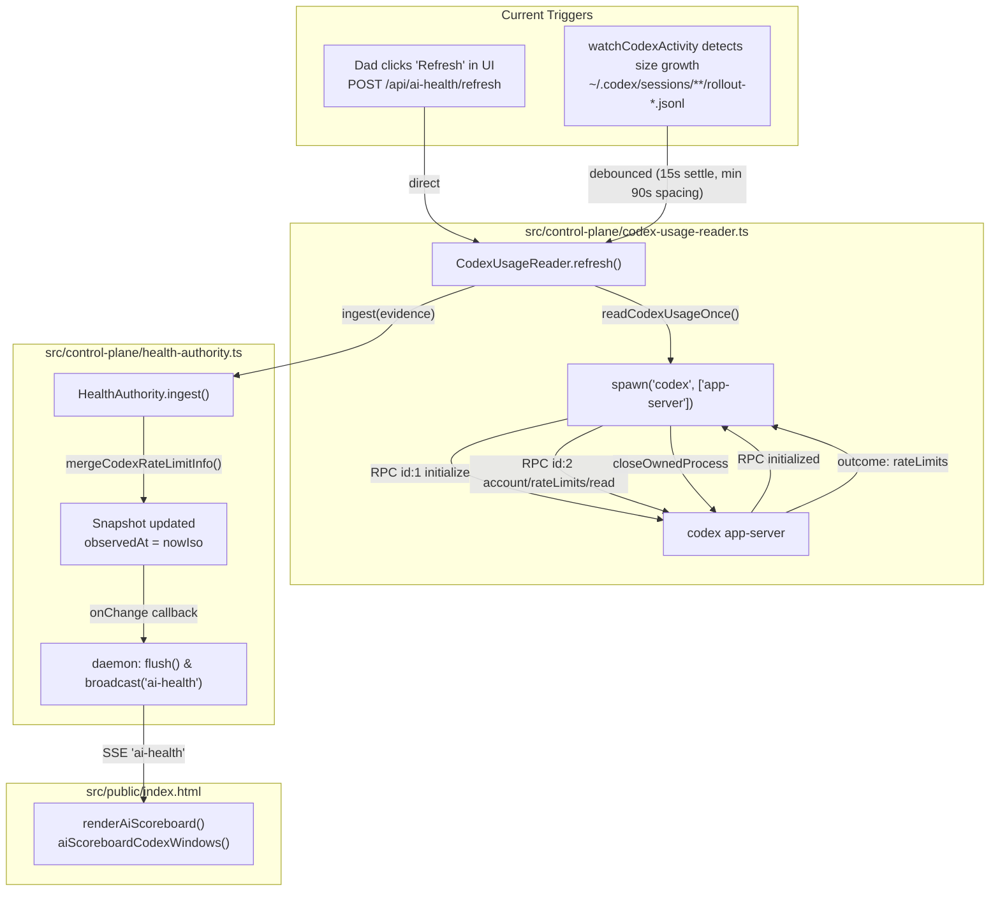

# S57.37 — Codex Live Usage Staleness Reconciliation

**PLAYER:** AntiGravity  
**ROLE:** Reconciler / Architecture Reconnaissance  
**MODE:** Read-only (Implementation Forbidden)  
**STATUS:** COMPLETE — READY FOR CLAUDE OPUS  

---

## 1. Executive Verdict

**VERDICT:**  
The observed live defect — where Sideline AI Usage Global persisted in presenting Codex usage at **96% / 96%** while the native VS Code surface showed **~75% / ~93%** and Sideline fired a "Codex stale" warning toast — is caused by an **asymmetric architecture defect**:

1. **Zero Background Polling for Codex:** `CodexUsageReader` explicitly has no periodic background polling loop (`src/control-plane/codex-usage-reader.ts:1-2, 316-317`). It relies exclusively on manual Refresh or its local rollout-file watcher.
2. **Defective Activity Watcher Assumption:** The activity watcher (`watchCodexActivity`) only scans `~/.codex/sessions/YYYY/MM/DD/rollout-*.jsonl`. Codex usage occurring in the **VS Code native extension**, on the web, or on another device produces zero writes to that directory. Consequently, when Dad uses Codex in VS Code, Sideline never observes any file growth and never triggers an authoritative read.
3. **No Automatic Reacquisition on Staleness:** When telemetry exceeds `maxStaleAgeMinutes` (30 minutes), `AlarmEngine` accurately detects staleness, transitions rule state to `UNKNOWN`, and fires `alarm:stale` ("Codex 5H usage is stale · current quota state is unknown"). However, **neither `AlarmEngine`, `HealthAuthority`, nor `ControlPlaneDaemon` initiates a refresh**. Staleness detection is an alert sink, not a healing trigger.
4. **UI Defense-in-Depth Asymmetry:** `src/public/index.html:5987-5994` enables `{ checkExpiry: true }` for Claude, but **omits `checkExpiry` for Codex**. Furthermore, the scoreboard UI has no guard against rendering telemetry when `Date.now() - observedAt > maxStaleAgeMinutes` or when `AlarmEngine` reports `UNKNOWN`. Thus, the scoreboard continued happily rendering the frozen 4% used (96% left) values from the stale snapshot.
5. **Orphaned Expiration Pruning:** `HealthAuthority.pruneExpired()` is **never invoked anywhere in production code** (no timer or daemon heartbeat calls it; it exists only in unit tests).

**Adjudication:** **Policy D (Hybrid Symmetrization)** is the only architecturally sound solution that satisfies the product invariant without burdening Dad with manual refresh duties.

---

## 2. Exact Current Execution Path

### 2.1 How Codex Usage is Acquired Today
There are exactly two entry points in the control plane that perform an authoritative Codex account read:



### 2.2 What Happens When External Codex Activity Occurs
When Dad uses Codex in VS Code (or web):
1. VS Code talks directly to OpenAI/Codex endpoints or internal VS Code state.
2. **No file writes occur** in `~/.codex/sessions/YYYY/MM/DD/rollout-*.jsonl` (field verified: on-disk session file remained frozen at 9:14 AM while Dad's activity continued through 10:14 AM in sqlite and VS Code).
3. `watchCodexActivity` observes zero byte growth.
4. `noteCodexActivity()` is never invoked.
5. `CodexUsageReader.refresh()` is never invoked.
6. `HealthAuthority` retains the previous `observedAt` and previous `rateLimitInfo`.

### 2.3 What Happens When Telemetry Ages Out (Staleness Path)
1. `AlarmEngine` has a timer scheduled via `scheduleClockReconciliation()` (heartbeat ~60s).
2. `AlarmEngine.evaluateTelemetry(snapshot)` runs `normalizeAlarmFacts()`.
3. In `src/control-plane/alarm-engine.ts:257`:
   $$\text{stale} = \text{now} - \text{observedMs} > 30 \times 60\,000 \text{ ms (30 minutes)}$$
4. `stale` evaluates to `true`.
5. `evaluateAlarmState()` evaluates `fact.stale === true` $\rightarrow$ returns `'UNKNOWN'`.
6. Transition from `NORMAL` $\rightarrow$ `UNKNOWN` triggers `transitionEventType()` $\rightarrow$ `'alarm:stale'`.
7. `createEvent()` constructs `AiAlarmEvent` with message:  
   `"Codex 5H usage is stale · current quota state is unknown"`.
8. `deliverAlarmEvent(event)` (`src/control-plane/daemon.ts:4350`):
   - Broadcasts SSE event `ai-alarm`.
   - Sends Web Push (`webPush.deliverAlarm`).
   - Forwards RPC notification `ai.alarm` to connected Stadiums/VS Code.
9. **UI Reaction (`src/public/index.html:7024-7036`):**
   - Receives `ai-alarm`.
   - Displays a 5-second toast: `showToast("Codex 5H usage is stale...", false, 5000)`.
   - **Does NOT touch `aiHealthSnapshot`.**
   - **Does NOT update or blank the scoreboard.**
10. **Result:** The toast vanishes after 5 seconds. The scoreboard continues displaying `Codex 5-hour: 96%` and `Codex Weekly: 96%` indefinitely.

---

## 3. Root Cause

The defect is rooted in three interrelated architectural omissions:

1. **Flawed Single-Trigger Design for Codex Freshness:**  
   `CodexUsageReader` assumed that all local Codex work would append to `~/.codex/sessions/**/rollout-*.jsonl`. That assumption is false: the native VS Code Codex extension, web interfaces, and other local/remote tools do not update CLI session rollout files.
2. **Absence of Polling Fallback in `CodexUsageReader`:**  
   Unlike `ClaudeUsageReader`, which pairs activity-watching with a 5-minute background polling loop, `CodexUsageReader` explicitly omitted periodic polling. Once the activity watcher fails to observe writes, no other mechanism exists to re-verify usage.
3. **Disconnection Between Staleness Detection and Healing:**  
   `AlarmEngine` is designed strictly as a passive evaluator and alerting sink. When it identifies that Codex telemetry is stale, it has no callback or authority to instruct `CodexUsageReader` to wake up and fetch fresh data.
4. **Scoreboard Rendering Without Freshness Gates:**  
   In `src/public/index.html:5991-5994`, `aiScoreboardCodexWindows()` passes `usedPercent` directly into DOM elements without verifying whether the underlying data has expired or is older than `maxStaleAgeMinutes`.

---

## 4. Why Claude Self-Heals and Codex Does Not

| Dimension | Claude Pipeline | Codex Pipeline |
| :--- | :--- | :--- |
| **Periodic Polling Loop** | **YES.** `ClaudeUsageReader.runAndSchedule()` runs every 5 min (configurable 3, 5, 10, 15 min). Restarts after any activity or manual refresh. | **NO.** Explicitly designed with zero background polling. |
| **Activity Signal Scope** | Watches `~/.claude/projects/**/*.jsonl` (Claude Code CLI transcripts). Even if it misses, periodic polling catches it in $\le 5$ min. | Watches `~/.codex/sessions/**/rollout-*.jsonl` (CLI only). Misses VS Code native extension completely. No polling fallback. |
| **UI Expiry Guard** | `aiScoreboardClaudeWindows()` passes `{ checkExpiry: true }` to `aiScoreboardNormalize()`. Expired 5H windows drop immediately to `UNKNOWN`. | `aiScoreboardCodexWindows()` omits `checkExpiry` (defaults to `false`). Expired windows render stale numbers. |
| **Post-Reset Zero Handling** | Explicitly converts provider idle state `{ utilization: 0, resets_at: null }` to canonical `{ utilization: 0, resetsAt: null }`. | No post-reset idle state mapping. |
| **Rate Limit / Gate States** | Models `rate_limited` with `Retry-After` provider-directed gates and internal fallback gates. | Models only `idle`, `ok`, `unavailable`. |

---

## 5. Stale-Rendering Policy Today

### 5.1 What the Backend Does
- `HealthAuthority` stores whatever was last ingested.
- `HealthAuthority` never purges records based on elapsed `observedAt` time.
- `HealthAuthority.pruneExpired()` (which drops windows where `resetsAt <= nowUnixSeconds`) is **dead code in production** — it is never scheduled or called outside tests.
- When `AlarmEngine` marks Codex `UNKNOWN`, it records that status in `~/.sideline/alarm-state.json`. It does **not** modify `HealthAuthority`'s state or the `/api/ai-health` payload.

### 5.2 What the Frontend Does
- On page load, `index.html` calls `GET /api/ai-health` to populate `aiHealthSnapshot`.
- It listens for SSE `ai-health` events (which only fire when `HealthAuthority` in-memory state changes).
- In `renderAiScoreboard()`:
  ```javascript
  const codex = codexState ? aiScoreboardCodexWindows(codexState.rateLimitInfo) : {};
  ```
  It inspects only `usedPercent` and `resetsAt`. It ignores `observedAt` age and ignores the provider's alarm state.
- **Copy Button:** `buildAiScoreboardCopyText()` formats clipboard text directly from `aiScoreboardCodexWindows()`, exporting stale percentages as truth.

---

## 6. Smallest Correct Repair Seam & Policy Adjudication

### 6.1 Adjudication of Candidate Policies

#### Policy A: Codex gets a Claude-like periodic polling fallback
- **Analysis:** Provides parity with Claude. However, running `readCodexUsageOnce()` involves spawning `codex app-server` via child process (~100–300ms execution, process creation). Polling every 5 or 10 minutes is completely feasible and low impact, but on machines without Codex installed, it must back off cleanly to avoid process churn.
- **Verdict:** Necessary to catch external VS Code usage, but insufficient on its own if an acquisition fails.

#### Policy B: Stale detection triggers an authoritative refresh
- **Analysis:** `AlarmEngine` checks telemetry every heartbeat (~60s). When `now - observedMs > maxStaleAgeMinutes` (30m), it detects staleness. If this trigger fires `codexUsageReader.refresh()`, it automatically heals without polling continuously. However, waiting 30 minutes before realizing usage has changed in VS Code is too long for Dad's live coding workflow.
- **Verdict:** Excellent reactive backstop, but insufficient as the sole mechanism.

#### Policy C: Stale values disappear / become UNKNOWN in UI
- **Analysis:** Prevents lying to Dad by blanking stale numbers to `UNKNOWN`. But without automatic reacquisition, Dad is forced to manually notice "UNKNOWN" and click Refresh.
- **Verdict:** Mandatory safety invariant, but unsatisfactory UX by itself.

#### Policy D: The Hybrid Symmetrization Policy (RECOMMENDED)
Policy D synthesizes the strengths of A, B, and C into a complete architectural repair:

1. **Periodic Refresh Fallback in `CodexUsageReader` (Policy A):**  
   Add a periodic background acquisition loop to `CodexUsageReader` with a safe cadence (e.g., 5 or 10 minutes, matching or proportional to Claude's 5m cadence). This guarantees that VS Code extension usage, web usage, and window resets are captured automatically without requiring local CLI session appends.
2. **Reactive Reacquisition on Staleness Wakeup (Policy B):**  
   In `daemon.ts`, when `AlarmEngine` fires `alarm:stale` (or when a horizon passes), if the provider is Codex and state is `UNKNOWN`, invoke `codexUsageReader.refresh()`. If the refresh succeeds, fresh values immediately overwrite stale values. If it fails, state remains `UNKNOWN`.
3. **UI Truth Invariant Enforcement (Policy C):**  
   In `src/public/index.html`:
   - Pass `{ checkExpiry: true }` to `aiScoreboardCodexWindows()`, ensuring parity with Claude.
   - If `Date.now() - Date.parse(observedAt) > maxStaleAgeMinutes * 60_000`, normalize windows to `undefined` so the UI renders `UNKNOWN` instead of false percentages.
4. **Schedule `HealthAuthority.pruneExpired()`:**  
   Call `this.healthAuthority.pruneExpired()` on daemon heartbeat or before returning snapshots, ensuring expired windows do not linger in canonical memory.

---

## 7. Files / Symbols

| File | Symbol / Location | Role in Repair |
| :--- | :--- | :--- |
| `src/control-plane/codex-usage-reader.ts` | `CodexUsageReader` (`start()`, `runAndSchedule()`, `cadenceMinutes`) | Add background scheduled loop and start/stop lifecycle matching `ClaudeUsageReader`. |
| `src/control-plane/daemon.ts` | `ControlPlaneDaemon.start()`, `deliverAlarmEvent()` | Call `this.codexUsageReader?.start()`. On `alarm:stale` event, trigger reacquisition attempt. |
| `src/control-plane/daemon.ts` | `scheduleClockReconciliation()` / heartbeat | Call `this.healthAuthority.pruneExpired()` periodically so expired windows leave state. |
| `src/control-plane/health-authority.ts` | `resolveCodexWindows()` / `mergeCodexRateLimitInfo()` | Ensure symmetric expiration and post-reset handling between Claude and Codex. |
| `src/public/index.html` | `aiScoreboardCodexWindows()` (line 5991) | Pass `{ checkExpiry: true }` to `aiScoreboardNormalize()`. |
| `src/public/index.html` | `aiScoreboardNormalize()` (line 5975) | Guard against staleness age (`observedAt > maxStaleAgeMinutes`). |

---

## 8. Tests Required

1. **Codex Background Polling Test:**  
   Verify that `CodexUsageReader` starts its scheduled loop, runs at configured cadence, debounces with activity triggers, and stops cleanly when `stop()` is called.
2. **VS Code External Usage Convergence Test:**  
   Verify that without any local `rollout-*.jsonl` file modification, `CodexUsageReader`'s scheduled loop executes and ingests updated rate limits into `HealthAuthority`.
3. **Stale Reacquisition Trigger Test:**  
   Advance clock past `maxStaleAgeMinutes`; verify that `AlarmEngine`'s staleness transition triggers `codexUsageReader.refresh()`.
4. **UI Expiry & Staleness Rendering Test (`test/ai-usage-scoreboard-ui.test.mjs`):**  
   Verify that when Codex `observedAt` exceeds 30 minutes or `resetsAt` is in the past:
   - Scoreboard renders `UNKNOWN` (not 96%).
   - Scoreboard copy text outputs `UNKNOWN` (not 96%).
5. **HealthAuthority `pruneExpired` Live Schedule Test:**  
   Verify that expired Codex windows are automatically purged by daemon schedule without manual intervention.

---

## 9. What Opus Must Decide

Before implementation, Claude Opus must adjudicate the following architectural specifics:

1. **Default Codex Polling Cadence:**  
   Should Codex match Claude's 5-minute default (`CLAUDE_USAGE_CADENCE_MINUTES`), or should it use a more relaxed 10-minute cadence to minimize `codex app-server` process spawns on lower-power machines?
2. **Failure Backoff Policy:**  
   If `codex app-server` fails repeatedly (e.g., CLI not found or login expired), what backoff curve should `CodexUsageReader` apply to avoid futile process spawning?
3. **UI Staleness Threshold Source:**  
   Should the frontend read `preferences.alarms.maxStaleAgeMinutes` dynamically from daemon status, or rely on canonical `UNKNOWN` status surfaced directly in `/api/ai-health`?
4. **Placement of Stale Invalidation:**  
   Should `HealthAuthority` itself strip rate limits when `observedAt` is stale, or should `HealthAuthority` keep the raw facts while the projection layer (`resolveCodexWindows` and `renderAiScoreboard`) maps them to `UNKNOWN`? (Recommendation: Keep raw facts in authority, project as `UNKNOWN` in presentation and alarm layers).

---

## 10. Scout Run Assessment

**Is another Scout run necessary?**  
**NO.**  
The scout evidence, failed lane diagnosis (openrouter rate-limiting during reconnaissance of `daemon.ts`), source code inspection, and runtime on-disk evidence in `~/.sideline/` and `~/.codex/` have completely converged:
- Every relevant file and symbol has been identified and verified.
- The root cause is completely explained and reproducible from code.
- No ambiguities remain regarding why Claude self-heals and Codex does not.
- The path forward is fully mapped for Claude Opus.
