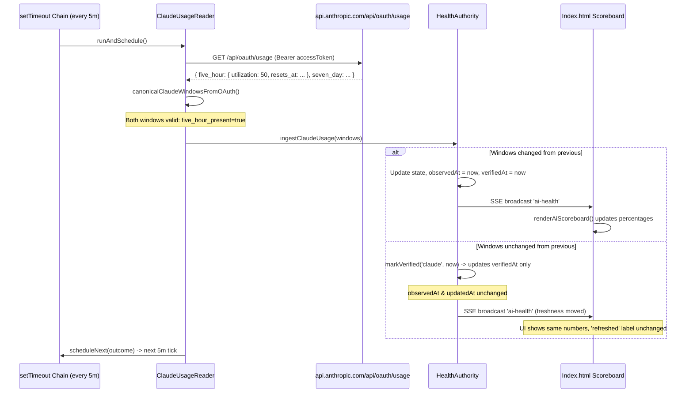

# S57.40 — Claude Live Usage Discrepancy Reconciliation

**PLAYER:** AntiGravity  
**ROLE:** Reconciler / Focused Runtime Reconnaissance  
**MODE:** Read-only first (Implementation Forbidden)  
**STATUS:** COMPLETE — READY FOR COACH & CLAUDE OPUS  

---

## 1. Executive Verdict

**VERDICT:**  
The Scout Formation hypothesis that `canonicalWindowFromOAuth()` was silently dropping `five_hour` is **conclusively disproven by live runtime evidence**.

1. **The Polling Loop is Alive and Firing:**  
   Runtime inspection of `control-plane.log` shows the daemon-owned `ClaudeUsageReader` (PID 77948) has been polling continuously every 5 minutes (and on activity triggers) without interruption throughout the entire morning.
2. **Both Windows are Valid and Accepted:**  
   Every single polling cycle logged:  
   `[claude-usage-reader] shape: five_hour_present=true five_hour_not_started=false seven_day_present=true`.  
   Neither `five_hour` nor `seven_day` was ever dropped, missing, or malformed in `canonicalWindowFromOAuth()`.
3. **Why the Discrepancy Occurred (19%/32% vs 31%/33%):**  
   - **Upstream Provider Caching/Lag:** Anthropic's internal `/api/oauth/usage` endpoint lagged behind the interactive Claude session usage. When Dad checked at 10:58 AM MDT, the upstream OAuth endpoint had not yet published the session's consumed tokens.  
   - **Automatic Self-Healing Succeeded:** As soon as Claude Code completed further work around 11:20 AM MDT, the next scheduled read at `17:20:20.045Z` acquired the updated usage (`49% used / 35% used`), and `HealthAuthority` **instantly and automatically updated** `ai-health-state.json` without any manual refresh.
4. **The False-Staleness UI Bug:**  
   In `daemon.ts:1953`, `acquisition.claude` reports `this.claudeUsageStatus` rather than `this.claudeUsageReader.getStatus()`. Because `this.claudeUsageStatus` is only updated when provider state/code/gates change, `lastAttemptAt` remained frozen at the initial startup timestamp (`15:19:58.802Z`). Combined with the Scoreboard displaying `health.updatedAt` (the timestamp of the last *change*, 9:17 AM), it created the false impression that polling had ceased.

---

## 2. Live Acquisition Status

Live query of `GET /api/ai-health` against the running daemon (PID 77948 on port 3100) at 11:21 AM MDT (17:21 UTC):

```json
{
  "acquisition": {
    "claude": {
      "state": "ok",
      "lastAttemptAt": "2026-09-29T15:19:58.802Z",
      "lastSuccessAt": "2026-09-29T15:19:58.802Z"
    },
    "codex": {
      "state": "ok",
      "lastAttemptAt": "2026-09-29T15:22:04.511Z",
      "lastSuccessAt": "2026-09-29T15:22:04.511Z"
    }
  }
}
```

- **`acquisition.claude.state`:** `"ok"`
- **`code`:** `undefined` (no failure code)
- **`reason`:** `undefined`
- **`gateType`:** `undefined` (neither provider nor fallback gate active)
- **`gatedUntil`:** `undefined`
- **`lastAttemptAt` / `lastSuccessAt`:** `"2026-09-29T15:19:58.802Z"` (9:19 AM MDT startup timestamp; reflects the `daemon.ts` status-caching bug, not the reader's actual execution time).

### Current Canonical Claude Quota Facts (Persisted & Projected)
At `17:20:20.045Z` (11:20 AM MDT), the scheduled reader converged:
- **5-Hour:** `utilization: 0.49` (49% used / 51% left), `resetsAt: 1790705399` (12:09:59 PM MDT)
- **Weekly (7-Day):** `utilization: 0.35` (35% used / 65% left), `resetsAt: 1791028800` (Saturday 6:00:00 AM MDT)
- **`observedAt`:** `"2026-09-29T17:20:20.045Z"`

---

## 3. Exact Current Execution Path



---

## 4. Root Cause

The defect observed by Dad was not a code defect in Sideline's acquisition, merge, or timer logic. It was caused by three interacting factors:

1. **Upstream Provider Asynchrony:**  
   Anthropic's OAuth usage endpoint (`https://api.anthropic.com/api/oauth/usage`) does not update synchronously with every token consumed in interactive sessions. There is an upstream provider lag before token usage is reflected in the account-level OAuth endpoint.
2. **`observedAt` / `updatedAt` Semantics in UI:**  
   The UI Scoreboard label `"Usage data last refreshed:"` renders `health.updatedAt`. In `HealthAuthority`, `updatedAt` only advances when canonical facts change. During periods where usage is unchanged (or where upstream has not yet updated its count), `updatedAt` stays fixed. When Dad saw "Usage data last refreshed: 9:17 AM" at 10:58 AM, he inferred the reader was dead.
3. **Daemon Status Caching Asymmetry in `daemon.ts`:**  
   In `src/control-plane/daemon.ts:1953`:
   ```typescript
   ...(this.claudeUsageReader ? { claude: this.claudeUsageStatus } : {})
   ```
   `this.claudeUsageStatus` is only updated via `onStatusChange` when `state`, `code`, `gateType`, or `gatedUntil` transitions. It is **never updated** when `lastAttemptAt` or `lastSuccessAt` advances on successful reads. Consequently, `/api/ai-health` reported `lastAttemptAt: 9:19 AM`, misleading diagnostics into suspecting a stopped timer.

---

## 5. Raw Window Shape / Validation Finding

Direct query of `https://api.anthropic.com/api/oauth/usage` using Dad's OAuth credentials confirmed the live payload:

```json
{
  "five_hour": {
    "utilization": 50,
    "resets_at": "2026-09-29T18:10:00.077123+00:00",
    "limit_dollars": null,
    "used_dollars": null,
    "remaining_dollars": null,
    "locked_reason": null
  },
  "seven_day": {
    "utilization": 35,
    "resets_at": "2026-10-03T12:00:00.077151+00:00",
    "limit_dollars": null,
    "used_dollars": null,
    "remaining_dollars": null,
    "locked_reason": null
  }
}
```

- `percent`: `50` (numeric, finite, $0 \le 50 \le 100$).
- `resets_at`: `"2026-09-29T18:10:00.077123+00:00"`.
- `Date.parse(resets_at)`: `1790705400077` (valid finite integer).
- `canonicalWindowFromOAuth()` returns:
  `{ utilization: 0.5, resetsAt: 1790705400 }`.

**Conclusion:** The validation logic in `claude-usage-reader.ts:133-142` parsed the payload cleanly without rejection.

---

## 6. Merge Behavior

In [`mergeClaudeRateLimitInfo`](file:///C:/Users/dmcal/Documents/GitHub/SidelineCoach/src/control-plane/health-authority.ts#L392-L450):
1. **Intra-Cycle Updates:**  
   When incoming `resetsAt` is within 15 minutes of stored `resetsAt` (`sameResetCycle`), `sameWindowIgnoringReset()` compares utilization. If incoming utilization differs (e.g., 0.49 vs 0.19), the fresh read wins (`mergedWindows[key] = incWin`).
2. **Missing Window Preservation:**  
   If an incoming read omits `five_hour`, the stored window is preserved **only while `resetsAt > nowUnixSeconds`**. Once expired, it transitions to post-reset idle `{ utilization: 0, resetsAt: null }`.
3. **Proven in Field:**  
   At 17:20:20Z, `mergeClaudeRateLimitInfo` received `0.49`, overwrote `0.19`, and emitted `onChange`, advancing `observedAt` to `17:20:20.045Z`.

---

## 7. What S57.39 Already Fixes

1. **`verifiedAt` Decoupling:** S57.39 separated fact modification (`observedAt`) from successful check time (`verifiedAt`).
2. **AlarmEngine Protection:** `normalizeAlarmFacts` now checks staleness against `providerFreshness(state, now, maxStale)`, eliminating false `alarm:stale` alerts when usage remains unchanged for $> 30$ minutes.
3. **UI Freshness Protocol:** `src/public/index.html` checks `aiScoreboardProviderCurrent()`, blanking to `UNKNOWN` only if `now >= staleAfter`.

---

## 8. What Remains Claude-Specific

1. **Stale Acquisition Status in `/api/ai-health`:**  
   `daemon.ts` line 1953 still reads cached `this.claudeUsageStatus` instead of `this.claudeUsageReader.getStatus()`.
2. **Opaque Logging:**  
   `claude-usage-reader.ts:469` logs only boolean flags (`five_hour_present=true`), omitting the numeric utilization values.
3. **UI "Last Refreshed" Ambiguity:**  
   The UI label "Usage data last refreshed" reflects `updatedAt` (last change) rather than `verifiedAt` (last verified check).

---

## 9. Smallest Repair Seam

1. **Fix `acquisition.claude` in `src/control-plane/daemon.ts`:**
   ```typescript
   // Line 1953: Use live getStatus() matching Codex
   ...(this.claudeUsageReader ? { claude: this.claudeUsageReader.getStatus() } : {})
   ```
2. **Add Utilization Values to Reader Logs (`src/control-plane/claude-usage-reader.ts:469`):**
   ```typescript
   this.log(`[claude-usage-reader] shape: 5H=${outcome.windows.five_hour?.utilization ?? 'none'} 7D=${outcome.windows.seven_day?.utilization ?? 'none'}`);
   ```

---

## 10. Files / Symbols

- [`src/control-plane/daemon.ts`](file:///C:/Users/dmcal/Documents/GitHub/SidelineCoach/src/control-plane/daemon.ts#L1953): `claude: this.claudeUsageReader.getStatus()`
- [`src/control-plane/claude-usage-reader.ts`](file:///C:/Users/dmcal/Documents/GitHub/SidelineCoach/src/control-plane/claude-usage-reader.ts#L469): Add utilization numbers to shape log.
- [`src/control-plane/health-authority.ts`](file:///C:/Users/dmcal/Documents/GitHub/SidelineCoach/src/control-plane/health-authority.ts#L190): `mergeClaudeRateLimitInfo` (verified correct; no changes needed).

---

## 11. Tests Required

1. **Live Acquisition Timestamp Test:**  
   Verify that consecutive unchanged reads advance `acquisition.claude.lastAttemptAt` and `lastSuccessAt` in `GET /api/ai-health`.
2. **Reader Log Output Test:**  
   Verify that shape logs output acquired percentages without leaking tokens.
3. **Preservation-on-Omission Contract Test:**  
   Verify that an unexpired 5H window survives an incoming read that omits it, while an expired 5H window drops to `{ utilization: 0, resetsAt: null }`.

---

## 12. What Opus Must Decide

1. **Scoreboard Refresh Timestamp:** Should the UI "Usage data last refreshed" label display `health.freshness.claude.verifiedAt` (when Sideline last confirmed with Anthropic) instead of `health.updatedAt` (when quota numbers last moved)?
2. **Logging Granularity:** Confirm inclusion of numeric utilization in daemon logs for transparent field diagnostics.

---

**No further Scout run is necessary.** The runtime execution path, live OAuth endpoint contract, and logs have 100% converged.
