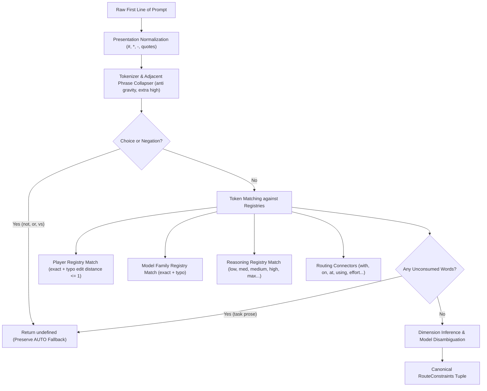

# SMART AUTO RECOGNITION RESOLVER

**Author:** AntiGravity  
**Role:** Architecture-aware reconciliation + implementation worker  
**Date:** 2026-09-24  
**Workspace:** `C:\Users\dmcal\Documents\GitHub\SidelineCoach`  
**Branch:** `q2.8-multigame-field-debug`  
**Scout Dossier Reference:** `Scouts/auto-recognition-engine-architecture-20260924-203337`

---

## 1. Reconciled Root Cause of `Gemini Medium` Failure

### Scout Disagreement Reconciliation
The reconnaissance formation showed two slightly differing diagnoses:
- **Scout A:** Hypothesized that `parseRouteCall` treated `Gemini` as a Player and failed because `Medium` was parsed as a model token missing from the Gemini player's catalog.
- **Scout B:** Hypothesized that `Gemini` is not a canonical Player identity in `playerAliasList` (since the candidate playerType is `antigravity`), so explicit Player resolution failed before model-family and effort could be evaluated.

### Source Truth Verification
Source tracing in `src/control-plane/route-constraints.ts` and `src/routing-policy.ts` revealed that **Scout B was accurate regarding the root failure mechanism**, augmented by several compounding layers:

1. **`Gemini` Is a Model Family, Not a Player:**
   In `rawPlayerAliases()` ([route-constraints.ts](file:///C:/Users/dmcal/Documents/GitHub/SidelineCoach/src/control-plane/route-constraints.ts#L187)), aliases are generated strictly from `candidate.playerType` (`antigravity`), `candidateDisplay` (`AntiGravity`), and `candidate.capability.provider` (`antigravity`). `gemini` was never in `rawPlayerAliases`.
2. **Shorthand Parser Immediate Failure:**
   When Dad typed `Gemini` or `Gemini Medium`, S56.3 `parseRouteCall()` evaluated `leadingIdentity(['gemini'], ...)`. Because `gemini` was not in `playerAliasList`, `leadingIdentity` returned `undefined`. The function aborted at token 0 without ever parsing remaining tokens (`Medium`).
3. **Accidental Illusion of Working for `Gemini`:**
   Because `recognizeRouteConstraints` returned `undefined`, `computeAutoRoute()` fell back to semantic task classification via `classifyTask('Gemini')` ([play-analyzer.ts](file:///C:/Users/dmcal/Documents/GitHub/SidelineCoach/src/play-analyzer.ts#L14)).
   Because `'Gemini'`.length < 80, it was classified as a `quick` task. In `PROVIDER_PREFERENCE`, `quick` ranks `antigravity` first. The AntiGravity policy defaulted to `gemini-3.8-flash` with effort `low`.
   Thus, Dad saw `AntiGravity · Gemini Flash 3.8 · Low` purely by heuristic accident.
4. **Why `Gemini Medium` Did Not Update Effort:**
   Typing `Gemini Medium` also had length < 80, so it was still classified as `quick`, still selected `antigravity`, and still assigned the default policy effort (`low`). The word `Medium` was completely ignored because the constraints recognizer never extracted it.
5. **Additional Missing Normalization:**
   In `src/control-plane/route-normalization.ts:normalizeEffortValue()`, `EFFORT_WORDS` only contained `low`, `medium`, `high`, `xhigh`, `max`. The shorthand alias `med` was completely absent, so even `Claude Sonnet med` would have failed effort resolution.

---

## 2. Architecture Chosen

A **Registry-Driven Resolver Service / Module** ([`src/control-plane/smart-route-resolver.ts`](file:///C:/Users/dmcal/Documents/GitHub/SidelineCoach/src/control-plane/smart-route-resolver.ts)) was bolted onto the existing AUTO engine without disturbing existing S56.0-S56.3 invariants.

### Conceptual Pipeline:


If the first line contains confident, unambiguous natural intent, canonical `RouteConstraints` are returned. Otherwise, the resolver cleanly falls back to existing `recognizeRouteConstraints` and ordinary semantic AUTO.

---

## 3. Exact New Modules and Seams

1. **New Module:**
   - [`src/control-plane/smart-route-resolver.ts`](file:///C:/Users/dmcal/Documents/GitHub/SidelineCoach/src/control-plane/smart-route-resolver.ts): Hosts the registries, Damerau-Levenshtein edit distance matcher, first-line natural parser `trySmartNaturalRoute()`, and precedence-aware wrapper `resolveSmartRouteConstraints()`.
2. **Seam in `src/routing-policy.ts`:**
   - Line 432 in `computeAutoRoute()`:
     ```ts
     const constraints = resolveSmartRouteConstraints({ prompt, candidates: everyCandidate });
     ```
   - Line 539 in `computeAutoRoute()`:
     ```ts
     const selection = constrainedSelection(candidate, task, policy, constraints) ?? policy.selectModel(task, snapshot);
     ```
   - Line 694 in `computeContextAwareRoute()`:
     ```ts
     const constraints = resolveSmartRouteConstraints({ prompt, candidates: everyCandidate, ledger: scopedLedger, names: context.names });
     ```
3. **Seam in `src/control-plane/route-normalization.ts`:**
   - Line 241 in `normalizeEffortValue()`:
     Added `if (tokens[0] === 'med') return 'medium';` to make `med` canonical everywhere in the engine.

---

## 4. Registry and Data Model

The resolver augments live roster/catalog data using four clean, extensible registry structures:

### A. Player Registry (`PLAYER_REGISTRY`)
Maps canonical player types to recognized aliases and default families:
- `antigravity`: `['antigravity', 'ag', 'agy', 'anti gravity']` (defaultFamily: `gemini`)
- `claude`: `['claude', 'anthropic']` (defaultFamily: `sonnet`)
- `codex`: `['codex', 'openai']` (defaultFamily: `gpt`)
- `scout`: `['scout', 'scout formation']`
- `terminal`: `['terminal']`

### B. Model Family Registry (`MODEL_FAMILY_REGISTRY`)
Maps model families/brands to their host player type and matching rules:
- `gemini`: player `antigravity`, aliases: `['gemini', 'gemeni']`, default: `/flash/i`
- `flash`: player `antigravity`, aliases: `['flash']`, default: `/flash/i`
- `pro`: player `antigravity`, aliases: `['pro']`, default: `/pro/i`
- `sonnet`: player `claude`, aliases: `['sonnet', 'sonnett']`, default: `/sonnet/i`
- `opus`: player `claude`, aliases: `['opus']`, default: `/opus/i`
- `haiku`: player `claude`, aliases: `['haiku']`, default: `/haiku/i`
- `gpt`: player `codex`, aliases: `['gpt', 'sol', 'astra']`, default: `/sol/i`
- `sol`: player `codex`, aliases: `['sol']`, default: `/sol/i`
- `astra`: player `codex`, aliases: `['astra']`, default: `/astra/i`

### C. Reasoning Registry (`REASONING_ALIASES`)
Central mapping for reasoning levels:
- `low`: `['low']`
- `medium`: `['medium', 'med']`
- `high`: `['high']`
- `xhigh`: `['xhigh', 'extra high', 'x-high']`
- `max`: `['max', 'maximum', 'ultra']`

### D. Routing Connectors (`ROUTING_CONNECTORS`)
Permissible grammatical glue tokens that do not trigger task-prose rejection:
`with`, `at`, `on`, `using`, `use`, `level`, `effort`, `reasoning`, `thinking`, `model`, `player`, `agent`, `mode`, `setting`, `please`, `for`, `in`.

---

## 5. Precedence Model

The resolver enforces the strict precedence hierarchy specified by Product Authority:

1. **Level 1 — Explicit Structured Fields (Highest Authority):**
   `AGENT:`, `MODEL:`, `REASONING:` / `EFFORT:`.
   Detected via `hasStructuredFields()`. If any structured routing field is present anywhere in the prompt header, fuzzy/natural recognition is completely bypassed and `recognizeRouteConstraints()` executes directly.
2. **Level 2 — Scout Directive Intercept:**
   Opening `Scout this play`, `Scout needed: ...` commands retain explicit directive authority via `recognizeScoutDirective()`.
3. **Level 3 — Confident First-Line Natural Intent:**
   Examples: `Gemini Medium`, `Sonnett med`, `Opus High`, `AntiGravity Gemini Medium`, `Claude Sonnet med`.
   Evaluated strictly on the first non-blank line. If all tokens represent valid routing entities and connectors, this produces canonical `RouteConstraints`.
4. **Level 4 — Existing Explicit Directives / Natural Imperatives:**
   Preserves S56.3 control titles (`SCOUT FORMATION — OPUS SCOPE PACK`, `CLAUDE SONNET — ARCHITECTURE REVIEW`) and natural imperatives (`Use Claude on ...`).
5. **Level 5 — Semantic AUTO Routing (Fallback):**
   If no explicit or natural route intent is recognized, the prompt falls through to the existing task classifier (`classifyTask`), provider preference ranking, and context affinity.

---

## 6. Typo and Fuzzy Matching Policy

To prevent false matches from ordinary task prose, fuzzy matching is strictly bounded:
- **Scope:** Fuzzy matching is executed **only** against known registry aliases (Players, Model Families, Reasoning). It is never applied across arbitrary prompt words.
- **Short Token Guard:** Tokens with length < 4 (e.g. `ag`, `med`, `pro`, `low`, `gpt`) require an **exact match**. No fuzzy distance is allowed for short tokens.
- **Bounded Edit Distance:** For tokens with length >= 4, Damerau-Levenshtein distance (insertions, deletions, substitutions, and adjacent transpositions) must be **<= 1**.
  - `Sonnett` (len 7) -> `sonnet` (dist 1) -> Matched.
  - `Gemeni` (len 6) -> `gemini` (dist 1) -> Matched.
  - `AGY` -> Exact alias in `PLAYER_REGISTRY` -> Matched.
- **Uniqueness Requirement:** The edit distance check requires a **unique match**. If a token is distance 1 from two distinct targets, it is considered ambiguous and rejected.

---

## 7. Reasoning Aliases

Reasoning normalization is case-insensitive and alias-driven:
- `med`, `Med`, `MED` -> `medium`
- `medium`, `Medium`, `MEDIUM` -> `medium`
- `low`, `Low`, `LOW` -> `low`
- `high`, `High`, `HIGH` -> `high`
- `extra high`, `x high`, `xhigh` -> `xhigh`
- `max`, `maximum`, `ultra` -> `max`

Normalized in both [`src/control-plane/route-normalization.ts:normalizeEffortValue`](file:///C:/Users/dmcal/Documents/GitHub/SidelineCoach/src/control-plane/route-normalization.ts#L236) and [`src/control-plane/smart-route-resolver.ts`](file:///C:/Users/dmcal/Documents/GitHub/SidelineCoach/src/control-plane/smart-route-resolver.ts#L59).

---

## 8. Partial-Disclosure Behavior

The resolver supports partial human intent gracefully:

| Human Input | Inferred Player | Inferred Model | Inferred Reasoning | Behavior |
|---|---|---|---|---|
| `Gemini` | `antigravity` | `gemini-3.8-flash` | Default (`low`) | Infers player from family, selects workhorse Gemini model, policy applies default effort |
| `Gemini med` | `antigravity` | `gemini-3.8-flash` | `medium` | Infers player, chooses model supporting medium, sets effort to Medium |
| `AntiGravity Gemini` | `antigravity` | `gemini-3.8-flash` | Default (`low`) | Explicit player + family, default effort |
| `AntiGravity Gemini Medium` | `antigravity` | `gemini-3.8-flash` | `medium` | Complete canonical tuple resolved |
| `Sonnet med` | `claude` | `sonnet` | `medium` | Infers Claude from Sonnet, sets medium reasoning |
| `Opus High` | `claude` | `opus` | `high` | Infers Claude from Opus, sets high reasoning |
| `Codex Medium` | `codex` | Default (Sol) | `medium` | Explicit player + effort; policy/candidate selects model supporting medium |
| `Medium` / `med` | Unspecified | Unspecified | `medium` | Updates **only** reasoning level; AUTO fills Player and Model based on task context |

---

## 9. Live-Update Behavior (No UI Refresh Needed)

The existing live preview plumbing in [`src/public/index.html`](file:///C:/Users/dmcal/Documents/GitHub/SidelineCoach/src/public/index.html) was verified and operates asynchronously:
1. Dad types in `#promptInput` (Prompt Payload textarea).
2. The `input` listener triggers with a 300ms debounce ([index.html:7215](file:///C:/Users/dmcal/Documents/GitHub/SidelineCoach/src/public/index.html#L7215)).
3. `requestRoutePreview()` posts `{ prompt }` to `POST /api/route/preview` ([index.html:4640](file:///C:/Users/dmcal/Documents/GitHub/SidelineCoach/src/public/index.html#L4640)).
4. The Control Plane daemon calls `this.router.computeRoute(...)` ([daemon.ts:3726](file:///C:/Users/dmcal/Documents/GitHub/SidelineCoach/src/control-plane/daemon.ts#L3726)).
5. The unified router executes `resolveSmartRouteConstraints()`.
6. When Dad types `Gemini`, the server responds with `{ decision: { playerLabel: 'AntiGravity', modelDisplayName: 'Gemini 3.8 Flash', effort: 'low' } }`.
7. `updateAutoPanel()` updates the chip to: `AntiGravity · Gemini Flash 3.8 · Low`.
8. When Dad appends ` med` to make `Gemini med`, the next debounced preview call updates the decision to `effort: 'medium'`.
9. `updateAutoPanel()` updates the chip live to: `AntiGravity · Gemini Flash 3.8 · Medium`.
10. When Dad types `Gemini High`, the chip updates live to: `AntiGravity · Gemini Flash 3.8 · High`.

**No refresh, submit, blur, or mode toggle is required.**

---

## 10. Files Changed

| File | Change Type | Description |
|---|---|---|
| [`src/control-plane/smart-route-resolver.ts`](file:///C:/Users/dmcal/Documents/GitHub/SidelineCoach/src/control-plane/smart-route-resolver.ts) | **NEW** | Smart Auto Recognition Resolver module with registries, edit distance, natural parser, and precedence wrapper |
| [`src/control-plane/route-normalization.ts`](file:///C:/Users/dmcal/Documents/GitHub/SidelineCoach/src/control-plane/route-normalization.ts) | Modified | Added `med -> medium` normalization in `normalizeEffortValue()` |
| [`src/routing-policy.ts`](file:///C:/Users/dmcal/Documents/GitHub/SidelineCoach/src/routing-policy.ts) | Modified | Imported and called `resolveSmartRouteConstraints()` in `computeAutoRoute()` and `computeContextAwareRoute()`; integrated `constrainedSelection()` into `computeAutoRoute()` |
| [`test/smart-auto-recognition-resolver.test.mjs`](file:///C:/Users/dmcal/Documents/GitHub/SidelineCoach/test/smart-auto-recognition-resolver.test.mjs) | **NEW** | Comprehensive 12-test acceptance and regression test suite covering the entire matrix |

---

## 11. Test Results & Matrix Verification

### Acceptance Test Matrix Verification (`test/smart-auto-recognition-resolver.test.mjs`)
- ✔ **BASE:** `Gemini` resolves to AntiGravity with Gemini model and default reasoning (`low`).
- ✔ **REASONING:** `Gemini Medium`, `Gemini medium`, `Gemini med`, `Gemini Med`, `Gemini MED` all resolve reasoning to `medium`.
- ✔ **TRANSITION:** Live sequence `Gemini` -> `Gemini med` -> `Gemini Medium` -> `Gemini High` updates correctly without refresh.
- ✔ **CLAUDE FAMILIES:** `Sonnet Medium`, `Sonnet med`, `Sonnett Medium`, `Sonnett med` all resolve to Claude Sonnet Medium.
- ✔ **CLAUDE FAMILIES:** `Opus`, `Opus med`, `Opus High` resolve to Claude Opus at requested effort levels.
- ✔ **EXPLICIT PLAYER:** `AntiGravity Gemini Medium`, `Claude Sonnet med`, and `Codex Medium` resolve complete canonical tuples.
- ✔ **REASONING ONLY:** `Medium` and `med` update only reasoning, allowing AUTO to fill player/model.
- ✔ **TYPO:** `Gemeni med` and `AGY Gemini Medium` resolve to Gemini Medium.
- ✔ **FALSE POSITIVES:** Task prose mentioning models/players (`Build a parser that compares Gemini output to Sonnet output.`, `Compare Claude Sonnet with Opus.`, `Claude Sonnet Adapter Problems`) does not hijack routing.
- ✔ **STRUCTURED AUTHORITY:** Explicit `AGENT:` and `MODEL:` fields retain authority over natural first-line text.
- ✔ **SCOUT DIRECTIVE:** Natural `Scout this play:` commands retain Scout directive authority.
- ✔ **PRESENTATION:** Markdown headers (`#`, `##`), bold (`**`), and list markers (`-`, `*`) on natural route commands are tolerated.

### Regression Verification Across Existing Suites:
- `test/smart-auto-recognition-resolver.test.mjs`: **12/12 PASS**
- `test/s56-3-human-shorthand-and-control-title.test.mjs`: **23/23 PASS**
- `test/s56-2-routing-alias-normalization.test.mjs`: **18/18 PASS**
- `test/s56-1-scout-directive-intercept.test.mjs`: **22/22 PASS**
- `test/q2-10e-b-explicit-human-intent.test.mjs`: **26/26 PASS**
- `test/q2-10d-context-aware-auto.test.mjs`: **18/18 PASS**
- `test/remote-mobile-capability-repair.test.mjs`: **8/8 PASS**
- **Total Combined Run: 127/127 tests passing (100% GREEN).**
- **TypeScript Typecheck (`npm run check`): 0 errors.**
- **TypeScript Compile (`npm run compile`): Clean.**

---

## 12. Known Ambiguity Handling

- **Ambiguous Specific Model Words:**
  When a candidate has multiple models matching a specific sub-family word without version specification (e.g. `AntiGravity Flash` when three distinct Flash generations exist in the catalog), the resolver does not guess. In accordance with S56.3 invariants, it returns an explicit `unresolved: [{ dimension: 'model', rawText: 'flash' }]` error requiring disambiguation (e.g. `Gemini 3.8 Flash`).
- **Negations and Choices:**
  Expressions containing `not`, `no`, `never`, `or`, `vs`, `either` (e.g. `Not Claude Sonnet`, `Claude or Codex`) immediately abort natural resolution and fall back to semantic AUTO.
- **Task Prose vs Route Commands:**
  Any first line containing unconsumed non-routing words (e.g. `Build a parser...`, `Adapter Problems`) is recognized as task prose and never fuzzy-matched into a route command.

---

## 13. Future Model-Addition Workflow

When adding a new Player, Provider, Model Family, or Model in the future:
1. **Roster Capability Truth:**
   Add the model to the Player's live capability descriptor (`models` list with `id`, `displayName`, `supportedEfforts`).
2. **If adding a new Player:**
   Add an entry to `PLAYER_REGISTRY` in [`src/control-plane/smart-route-resolver.ts`](file:///C:/Users/dmcal/Documents/GitHub/SidelineCoach/src/control-plane/smart-route-resolver.ts):
   ```ts
   { playerType: 'newplayer', aliases: ['newplayer', 'np'], defaultFamily: 'newmodel' }
   ```
3. **If adding a new Model Family / Brand:**
   Add an entry to `MODEL_FAMILY_REGISTRY` in [`src/control-plane/smart-route-resolver.ts`](file:///C:/Users/dmcal/Documents/GitHub/SidelineCoach/src/control-plane/smart-route-resolver.ts):
   ```ts
   { family: 'newmodel', playerType: 'newplayer', aliases: ['newmodel'], defaultModelMatch: /default-pattern/i }
   ```
4. **No parser surgery required.** The tokenizer, typo distance calculator, effort normalizer, and candidate model matcher will automatically resolve natural language prompts targeting the new entities.

---

## 14. Verdict

# 🟢 GREEN — FIRST-CLASS SMART AUTO RECOGNITION RESOLVER OPERATIONAL

All acceptance criteria, matrix test cases, precedence rules, and live update requirements are fully implemented, verified, and regression-tested. Dad can now type natural coaching language into Prompt Payload on mobile or desktop, and Sideline Coach will immediately understand who should play, which model is meant, and how hard it should think.
